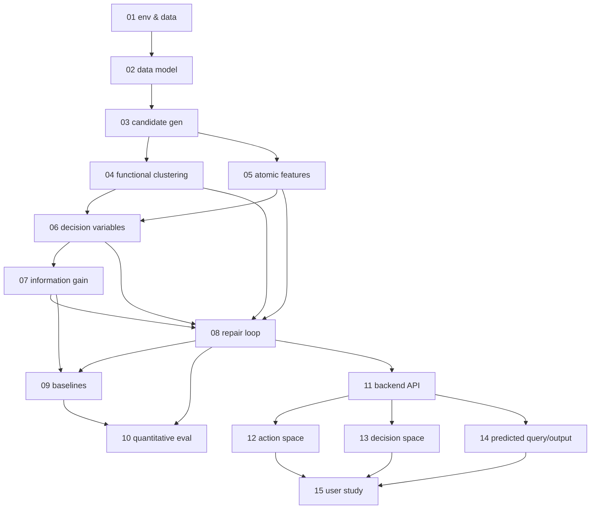

# PleaSQLarify — Replication Specs

This directory is a **spec-driven replication** of:

> Robin Shing Moon Chan, Rita Sevastjanova, and Mennatallah El-Assady. 2026.
> *PleaSQLarify: Visual Pragmatic Repair for Natural Language Database Querying.*
> Proceedings of the CHI Conference on Human Factors in Computing Systems (CHI '26).
> https://doi.org/10.1145/3772318.3791265

The source paper is at [`paper.pdf`](paper.pdf). Every spec cites the paper by
page and figure/equation so a reader can trace each design decision back to its
origin.

The goal is to reproduce, **in sequence and repeatably**, the paper's research
artifacts: the pragmatic-repair algorithm (Section 5–6), its quantitative
evaluation on AMBROSIA (Section 7, Figure 5), the visual interface (Section 8),
and the user-study protocol (Section 9). These specs are the input to later code
implementation, which in turn feeds later user studies.

---

## How to read this deck

1. Specs are **numbered in dependency order**. Executing them `01 → 15` in
   sequence reconstructs the system from nothing. The numeric prefix is a visual
   aid; the **authoritative order is the `depends_on` frontmatter** (the
   `wf-spec-*` tooling keys off that, not the filename).
2. Each spec is scoped to **one implementable unit of work** — small enough to
   dispatch to a single implementation pass, with its own acceptance criteria.
3. Each spec carries a **Core Assumptions & Undocumented Decisions** section.
   These are the paper's implementation gaps. They are the heart of this
   deck (see [Ground rules](#ground-rules-paper-first) below).

## Ground rules (paper-first)

Decided with the project owner:

- **The paper is the source of truth.** Where the paper specifies a decision, we
  follow it exactly and cite it.
- **Undocumented decisions are flagged, not hidden.** For every gap, the spec
  states (a) a **recommended default** we will implement, (b) the **alternatives**
  we considered, and (c) what the paper *implies* if anything. These are
  collected per-spec and summarized in the [Assumptions Register](#consolidated-assumptions-register).
- **The published implementation is NOT usable as ground truth.** The paper
  advertises code at `github.com/chanr0/pleasqlarify`. As of 2026-07-01 that
  repository's `main` branch contains only a 14-byte `README.md`. The only code
  is in a **draft PR #1** (`copilot/update-code-for-chi26-publication`) that was
  **authored by GitHub Copilot** ("Bootstrap CHI'26 publication repository"), not
  by the paper authors. That skeleton *contradicts* the paper (it uses `sqlparse`
  instead of the Spider SQL parser, and contains no LLM sampling, embeddings,
  clustering, UMAP, information gain, or AMBROSIA integration). It therefore has
  no more authority than our own reasoning, and we do **not** treat it as a
  reference to fill gaps. If the authors publish real code later, revisit the
  assumption registers.

---

## Track layout

| Track | Purpose |
|---|---|
| [`foundations/`](foundations) | Environment, data, and the shared object model every other spec builds on. |
| [`algorithm/`](algorithm) | The Section 5–6 pragmatic-repair pipeline, one step per spec. |
| [`evaluation/`](evaluation) | The Section 7 quantitative evaluation on AMBROSIA (Figure 5). |
| [`interface/`](interface) | The Section 8 visual interface, one view per spec, plus its backend. |
| [`study/`](study) | The Section 9 user-study protocol and materials. |

> **Precedence update (spec 17).** The authors' supplementary code is now
> available and is ground truth for decisions the paper leaves unstated — it is
> what their reported numbers were produced by. Order: **paper → authors' code →
> our documented gap-fills**. Rows marked ✅ in the register below are settled from
> their code; several of our earlier defaults were wrong and have been corrected.
> See [`evaluation/17-authors-supplement.md`](evaluation/17-authors-supplement.md).

## Sequential spec list

Execute top-to-bottom. **Implementation status (2026-07-01):** specs 01–14 are
implemented in `src/pleasqlarify/` and covered by an offline test suite
(`tests/`, 48 tests, ~90% coverage); spec 15 is a study protocol to be executed
later against the built system. See the top-level [`README.md`](../README.md).

| # | Spec | Delivers | Status |
|---|---|---|---|
| 01 | [foundations/01-environment-and-data.md](foundations/01-environment-and-data.md) | Python env, dependencies, AMBROSIA acquisition, per-sample SQLite execution harness. | drafted |
| 02 | [foundations/02-data-model-and-notation.md](foundations/02-data-model-and-notation.md) | **Keystone.** Canonical objects `A`, `z`, `M`, `Z`, `p_t` shared by all downstream specs. | drafted |
| 03 | [algorithm/03-candidate-generation.md](algorithm/03-candidate-generation.md) | Step 1: LLM sampling of the action space `A` (N=50 @ T=0.7), validity filtering. | drafted |
| 04 | [algorithm/04-functional-clustering.md](algorithm/04-functional-clustering.md) | Step 2: execute → serialize output → embed → similarity matrix `S` → hierarchical clustering. | drafted |
| 05 | [algorithm/05-atomic-feature-extraction.md](algorithm/05-atomic-feature-extraction.md) | Step 3a: AST parse → binary atomic-feature vector `z ∈ {0,1}^d`. | drafted |
| 06 | [algorithm/06-decision-variables.md](algorithm/06-decision-variables.md) | Step 3b/3: group features; lift-based characteristic extraction; co-occurrence implicit inclusion. | drafted |
| 07 | [algorithm/07-information-gain-ranking.md](algorithm/07-information-gain-ranking.md) | Step 4: belief `p_t(m)`, expected information gain, argmax decision-variable selection. | drafted |
| 08 | [algorithm/08-iterative-repair-loop.md](algorithm/08-iterative-repair-loop.md) | Step 5: filter + recluster; turn-by-turn loop until a single functional class remains. | drafted |
| 09 | [evaluation/09-baselines.md](evaluation/09-baselines.md) | The three baselines + two "ours" variants for the quantitative comparison. | drafted |
| 10 | [evaluation/10-ambrosia-quantitative-eval.md](evaluation/10-ambrosia-quantitative-eval.md) | Reproduce Figure 5: gold entropy + output similarity per turn with bootstrap CIs; simulated-user oracle. | drafted |
| 11 | [interface/11-backend-api.md](interface/11-backend-api.md) | Session/state backend exposing the pipeline to the UI. | drafted |
| 12 | [interface/12-action-space.md](interface/12-action-space.md) | UMAP projection + Voronoi glyph view + click/hover/lasso interactions. | drafted |
| 13 | [interface/13-decision-space.md](interface/13-decision-space.md) | Ranked decision-variable panel, example query, yes/no + arrow navigation. | drafted |
| 14 | [interface/14-predicted-query-and-output.md](interface/14-predicted-query-and-output.md) | Predicted-query atomic-feature list with probabilities + live predicted output. | drafted |
| 15 | [study/15-user-study-protocol.md](study/15-user-study-protocol.md) | Reproducible user-study protocol: 12 participants, 5 tasks, SUS + component questionnaires. | drafted |
| 16 | [evaluation/16-assumption-sweep.md](evaluation/16-assumption-sweep.md) | Pre-registered sweep of the A4/A5/A12 assumptions: fixed yardstick, dev/held-out split, degeneracy guard. | pre-registered |
| 17 | [evaluation/17-authors-supplement.md](evaluation/17-authors-supplement.md) | **The authors' supplementary code as ground truth**: settles A3–A6, A12, A14–A16; records what it does not settle. | authoritative |

## Dependency graph

---

## Consolidated Assumptions Register

Each row is an undocumented decision the paper leaves open. The owning spec
carries the full reasoning (recommended default + alternatives). This table is
the index; treat the per-spec sections as authoritative.

**Status legend.** ✅ **resolved** = settled from the authors' supplementary code
(see [`specs/evaluation/17-authors-supplement.md`](evaluation/17-authors-supplement.md));
the "default" column then records *their* decision, not our guess. ⬜ = still an
open gap-fill of ours.

| ID | Decision the paper leaves open | Owning spec | Decision (✅ = the authors' actual code) |
|---|---|---|---|
| A1 | Which LLM generates candidates; exact prompt, schema context, few-shot | 03 | ⬜ **Still open — generation code is absent from the supplement.** Their precomputed pools (~95/question) are usable directly |
| A2 | How invalid candidates are detected (parse vs execute); dedup policy | 03 | Drop on Spider-parse failure; keep functional duplicates (they inform priors) |
| A3 | How a result table is serialized to text before embedding | 04 | ✅ **Per-ROW strings** (`" ".join(cells)`), shorter table padded with `<NULL>` — not one whole-table string |
| A4 | Embedding similarity metric; empty/error-result handling | 04 | ✅ **Optimal row alignment**: embed rows, Hungarian-match on `1−cos`, mean of matched pairs; empty-vs-empty = 1 |
| A5 | Hierarchical-clustering linkage + how #clusters is chosen | 04 | ✅ Average linkage; **k = max(2, min(4, round(n/10) or 2))** on survivors, recomputed each turn. Their silhouette selector is dead code |
| A6 | Exact atomic-feature vocabulary and value granularity (literals, `=` vs `LIKE`) | 05 | ✅ The **entire WHERE clause is ONE atom** (boolean structure preserved); set-ops recurse into both branches with depth in the atom |
| A7 | Column/table alias canonicalization for atoms | 05 | Resolve aliases to base table.column before encoding |
| A8 | Feature-grouping algorithm; lift threshold; co-occurrence threshold | 06 | Group by cluster; lift > 1 for characteristic; co-occ ≥ 0.95 for implicit |
| A9 | Belief `p_t(m)` initialization (uniform vs LLM priors) | 07 | Uniform over surviving functional classes; alternative: sampling frequency |
| A10 | Intent set `M` vs action set `A` mapping | 07 | One intent per functional cluster; actions in a cluster are equivalent |
| A11 | Decision-variable value set (binary vs multi-valued) | 07 | Binary contains/excludes, per Figure 4/8 |
| A12 | Loop termination (single action vs single functional class) | 08 | ✅ **Mean pairwise similarity of survivors ≥ 1** (`stop_mode="sim1"`, tol 1e-9) — stricter than a single cluster |
| A13 | Simulated-user oracle answering policy in the eval | 10 | Answer yes/no by whether the gold query carries the decision variable |
| A14 | Gold-intent assignment rule for generated candidates | 10 | ✅ **Exact execution-output equality**, then per-ambiguity-type AST heuristics; **not** embedding similarity |
| A15 | "Gold-label entropy" and "output similarity" metric definitions | 10 | ✅ Shannon entropy in **bits** (`np.log2`), un-normalized |
| A16 | Fig 5 legend "ERG" vs text "EIG-without-clustering" naming mismatch | 10 | ✅ **Resolved: "ERG" is not in their code.** Fig 5's baseline is `ATOMIC`+`EIG`, labelled "Baseline EIG + Atomic Features" |
| A17 | UMAP hyperparameters; distance input (precomputed vs feature) | 12 | `metric='precomputed'` on `1 − S`; defaults otherwise (see spec) |
| A18 | Frontend/backend tech stack (paper only shows a hosted tool) | 11 | Python (FastAPI) backend + web frontend; see spec for rationale |

---

## Conventions

- **Frontmatter** follows the shared spec document model: `title`, `status`,
  `depends_on`, `affects`, `effort`, `created`, `updated`, `author`,
  `dispatched_task_id`.
- **`affects`** lists the *intended* target code paths (the code does not exist
  yet); this is the contract for the later implementation phase.
- Every spec includes a Mermaid architecture/flow diagram, an itemized list of
  technical decisions, the assumptions section, and acceptance/testing criteria.
- Commit one spec (or one small coherent batch) at a time.
