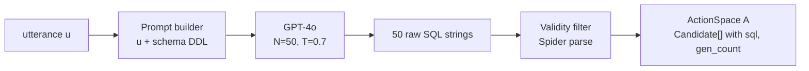

# Step 1 — Candidate Generation (Sampling the Action Space `A`)

## Overview

The pipeline begins by materializing the action space `A = {a_1,…,a_N}`: a finite
set of probable SQL interpretations of the ambiguous utterance `u`, produced by
sampling a language model conditioned on `u`. This surfaces the model's *probable*
interpretations for the user to explore (design requirement R1) and is the input
to clustering (spec 04) and feature extraction (spec 05).

## Paper grounding

- "we first generate a finite candidate set of `N` probable system actions
  `A = {a_1,…,a_N}` … attained by resampling a language model conditioned on the
  input utterance `u` … `A = {a_i ~ p_LM(a∣u)}_{i=1}^N`" (p. 6, Step 1).
- Evaluation setup: "we generate a set of candidate queries `A` by prompting
  GPT-4o [30] `N = 50` times with the ambiguous query at high temperature" and
  "We used 0.7 to balance the syntactical correctness of the generated SQL with
  the diversity of generated programs" (p. 7, footnote 5).
- "We drop syntactically invalid candidate queries from the candidate set, as
  these are not part of the action space `A`. The effective number of considered
  candidates is, therefore, ≤ 50." (p. 7, footnote 4).
- The candidate pool is **fixed** to this initial set for the whole interaction:
  "the candidate set was fixed to the initial set of around 50 language model
  generations" (Limitations, p. 15).

## Architecture

## Components

### LLM client

- File: `src/pleasqlarify/llm/client.py`.
- Wraps the generation model behind an interface `generate(prompt, n, temperature)`
  so the eval (GPT-4o) and any local/offline model share one seam.
- Records raw completions verbatim for auditability (reproducibility of a
  stochastic step; see assumption A-gen-4).

### Prompt builder

- File part of `src/pleasqlarify/pipeline/generate.py`.
- Builds the generation prompt from `u` plus the sample's schema. The schema is
  rendered as `CREATE TABLE` DDL (table names, columns, types, FKs) so the model
  can produce column/table-correct SQL. Instruction: "Return exactly one SQL
  query answering the question against this schema." (see assumption A1).

### Sampler + validity filter

- Call the LLM `N = 50` times at `T = 0.7` (independent samples, not a single
  batched high-`n` call unless the provider guarantees independence).
- Parse each completion with the **Spider SQL parser** (spec 01). Drop any that
  fail to parse → effective candidates ≤ 50 (paper footnote 4).
- Populate `Candidate.sql` and `Candidate.gen_count` (count of identical raw
  queries collapsed into one candidate — this frequency is the raw material for
  the belief prior in spec 07, assumption A9). AST/`z`/result fields are filled by
  specs 05/04.

## Data Flow

`u` + schema → prompt → 50 sampled SQL strings → parse-filter → deduplicated
`ActionSpace` (each unique query once, with `gen_count`) handed to spec 04
(clustering) and spec 05 (feature extraction).

## Core Assumptions & Undocumented Decisions

- **A1 — Prompt template & schema context.** The paper never gives the prompt,
  whether the schema/DDL or sample rows are included, or whether it is zero-shot
  vs few-shot.
  - *Recommended default:* zero-shot; include full `CREATE TABLE` DDL; no sample
    rows; single-query instruction. Store the template in the repo so it is
    versioned.
  - *Alternatives:* few-shot with 1–2 exemplars (raises correctness, may bias
    diversity); include sample rows (helps value literals like `'Drama'`, but
    leaks the test DB into generation). Flagged: strongly affects which
    interpretations appear.
- **A2 — Validity = parse vs execute; dedup policy.** Paper says drop
  *syntactically* invalid (parse-based), not execution-based.
  - *Recommended default:* drop on Spider-parse failure only; keep queries that
    parse but error at execution (they still represent an intent; spec 04 handles
    error results). **Collapse byte-identical raw queries** into one candidate
    with `gen_count`, but **keep functionally-equivalent-but-textually-different**
    queries (clustering, spec 04, is responsible for grouping those).
  - *Alternative:* also drop execution-erroring queries up front (smaller `A`,
    but discards valid intents that merely reference a wrong column name).
- **A3 — Independent samples vs single `n=50` call.** *Default:* `N` independent
  requests for genuine i.i.d. sampling; a single `n=50` call is acceptable if the
  provider documents independence.
- **A4 — Generation model swap for offline replication.** GPT-4o is closed and
  will drift. *Default:* pin the API model string and cache all raw completions
  in `data/generations/` keyed by `(sample_id, seed)` so downstream specs and
  tests are reproducible without live API calls. *Alternative:* an open model
  (e.g. a strong local coder model) for a fully offline replication — record it
  as a variant.
- **A5 — Temperature.** Fixed by the paper at **0.7** (footnote 5). Not an
  assumption; pinned.

## Testing Strategy

- Unit: validity filter drops known-unparseable SQL and keeps valid SQL; identical
  raw queries collapse with correct `gen_count`.
- Unit (mocked LLM): a stubbed client returning a fixed list yields a
  deterministic `ActionSpace` — enables all downstream tests to run offline.
- Integration (cached, no live API): from cached GPT-4o completions for ≥ 1
  AMBROSIA sample, produce `≤ 50` parseable candidates spanning ≥ 2 distinct
  interpretations.

## Acceptance Criteria

1. `generate(sample)` returns a deterministic `ActionSpace` given a fixed
   completion cache.
2. Effective candidate count ≤ 50; all survive Spider parsing.
3. Raw completions are cached for offline reproduction.
4. Assumptions A1–A4 recorded with chosen defaults before spec 04 is implemented.
