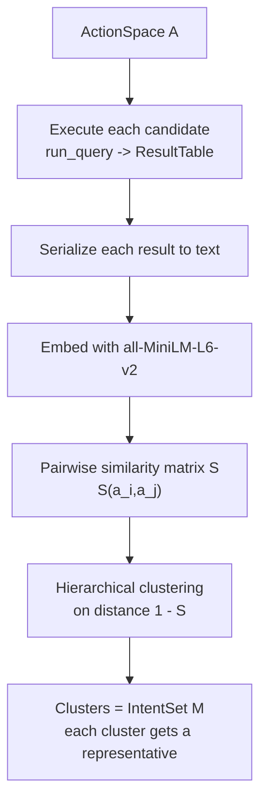

# Step 2 — Functional Clustering (Output Similarity → Intents `M`)

## Overview

Multiple SQL queries can realize the same *intent* — they are **functionally
equivalent** if they produce the same output (design requirement R2:
differentiate between intents, not functionally-equivalent actions). This step
executes every candidate, measures pairwise **functional output similarity**, and
clusters the candidates into functionally coherent groups. Each cluster is an
intent `m` in `M` (spec 02, assumption M2). Clustering is the backbone the whole
approach rests on: the quantitative eval shows clustering-based strategies
collapse uncertainty faster than atomic baselines (spec 09/10, Figure 5).

## Paper grounding

- "two system actions are *functionally equivalent* if they produce the same
  functional outcome. Let `m(a, C)` denote the outcome … `S(a_i, a_j)` … if
  `S(a_i, a_j) ≈ 1`, the results are nearly identical. Using this similarity
  measure, we cluster candidate actions to produce semantically coherent regions"
  (p. 5, Step 2).
- Instantiation for SQL: "we consider two SQL queries functionally similar if
  they produce a similar output when run against some test database `D`" (p. 6,
  Step 2). "Note that functional equivalence in this setting is *approximate*:
  two SQL queries are strictly equivalent iff they yield identical outputs for
  all possible databases [19]" (p. 6).
- Eval mechanics: "We construct the output similarity matrix `S` by executing each
  query against the test database provided by AMBROSIA and computing
  embedding-based output similarity using `all-MiniLM-L6-v2` [34]. We cluster
  outputs using hierarchical clustering [16], as this is a deterministic algorithm
  that allows us to exactly specify the number of clusters." (p. 7, Setup).

## Architecture

## Components

### Execution + result serialization

- File: `src/pleasqlarify/pipeline/embed.py`.
- Execute each candidate via the spec 01 harness (canonicalized ordering) →
  `ResultTable`.
- Serialize a `ResultTable` to a single deterministic string for embedding:
  column header line + row-major values (see assumption A3). Cap length to the
  embedder's token limit; oversized tables are truncated deterministically with a
  recorded marker.

### Embedding + similarity matrix `S`

- Embed each serialized output with `all-MiniLM-L6-v2` (via
  `sentence-transformers`).
- `S[i][j] = cosine(embed(out_i), embed(out_j))` → symmetric `N×N` matrix in
  `[−1,1]` (in practice `[0,1]` for these outputs). This realizes `S(a_i,a_j)`.

### Hierarchical clustering → `M`

- File: `src/pleasqlarify/pipeline/cluster.py`.
- Convert similarity to distance `D = 1 − S`. Run agglomerative hierarchical
  clustering on `D` (precomputed metric). Deterministic (paper's stated reason
  for choosing it).
- Assign `Candidate.cluster_id`; build `IntentSet` (`Cluster` per group) and pick
  a `representative_id` per cluster (the highest-`gen_count`, i.e. most probable,
  member — see assumption A-clu-3).

## Data Flow

`A` → results → serialized strings → embeddings → `S` → `D = 1−S` → clusters →
`IntentSet M` (with representatives) handed to spec 06 (decision variables), spec
07 (belief/IG), and spec 08 (recluster on the filtered set).

## Core Assumptions & Undocumented Decisions

- **A3 — Result-table → text serialization.** The single most consequential
  undocumented decision here: how a table becomes one string for the sentence
  embedder.
  - *Recommended default:* header row of column names, then each (canonically
    sorted) data row rendered `col=value` joined by `; `, rows joined by newline;
    length-capped. Deterministic and order-independent (pairs with F3 in spec 01).
  - *Alternatives:* raw CSV dump (order-sensitive); embed only the *set of
    values* ignoring column layout (robust to column renaming, loses structure);
    embed a JSON of the result. Flagged: changes `S` and therefore every cluster.
- **A4 — Similarity metric + degenerate results.** Paper says "embedding-based
  output similarity" but not the metric, nor how empty/error results are handled.
  - *Recommended default:* **cosine** similarity. Map **execution errors and
    empty results to a reserved sentinel embedding** so all erroring queries
    cluster together and away from value-bearing outputs.
  - *Alternative:* Euclidean on normalized embeddings (≈ monotone with cosine);
    exclude erroring queries entirely (but that shrinks `A` unpredictably).
- **A5 — Linkage + number of clusters.** Paper picks hierarchical clustering
  *because* it lets them "exactly specify the number of clusters" — but never
  states the linkage or how `k` is chosen per sample.
  - *Recommended default:* **average linkage** on `1−S`; choose `k` by a distance
    threshold `τ` (cut the dendrogram where merges exceed `1 − S_sim`, e.g.
    `τ = 0.1` ⇒ merge outputs with ≥ 0.9 cosine similarity). This makes `k`
    data-driven and consistent across samples.
    - **Eval note:** For the AMBROSIA eval, the *gold* number of interpretations
      is known (≥ 2 per sample). Provide a switch to set `k = #gold intents` when
      benchmarking (the paper's "exactly specify the number of clusters" reading),
      versus threshold-based `k` for the interactive tool where gold `k` is
      unknown. This dual behavior must be explicit (see spec 10).
  - *Alternatives:* Ward or complete linkage; silhouette-optimal `k`; fixed `k`.
- **A-clu-3 — Cluster representative.** Not specified. *Default:* the member with
  the highest `gen_count` (most probable). *Alternative:* medoid (closest to
  cluster centroid in embedding space).

## Testing Strategy

- Unit: serialization is deterministic and order-independent for logically-equal
  unordered results.
- Unit: `S` is symmetric, unit diagonal; identical outputs → `S = 1` → same
  cluster; disjoint outputs → low `S` → different clusters (synthetic fixtures).
- Unit: error/empty results land in the sentinel cluster.
- Integration: on an AMBROSIA sample, the two gold queries (which encode distinct
  intents and produce distinct outputs) fall into **different** clusters — the
  core correctness property of this step.
- Determinism: same input ⇒ identical cluster assignments across runs.

## Acceptance Criteria

1. `cluster(action_space, db_path)` returns an `IntentSet` with stable ids.
2. Gold interpretations of a benchmark sample separate into distinct clusters.
3. `k`-selection supports both threshold mode (tool) and gold-`k` mode (eval).
4. Assumptions A3–A5 recorded with chosen defaults before spec 06/10.
