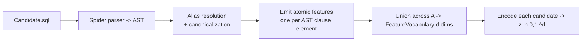

# Step 3a — Atomic Feature Extraction (AST → `z ∈ {0,1}^d`)

## Overview

To discriminate between candidate actions, each SQL query is parsed to an
abstract syntax tree and encoded as a **binary atomic feature vector**
`z(a) ∈ {0,1}^d`. Each dimension is the presence of one atomic action component —
the smallest distinguishable unit between actions (design requirement R1). These
atoms are the raw material grouped into interpretable decision variables (spec 06)
and shown in the Predicted Query panel (spec 14).

## Paper grounding

- "we represent each action as a `d`-dimensional binary atomic feature vector
  `z(a) ∈ {0,1}^d`, where each dimension corresponds to the presence of a specific
  atomic action component. These atoms are the smallest distinguishable units
  between actions and enable incremental, interpretable decision-making (R1)."
  (p. 5, 3a).
- SQL instantiation: "we parse each query into an abstract syntax tree and encode
  clause elements (e.g., `GROUP BY column_x` or `SELECT column_y`) as binary
  features." (p. 6, Section 6).
- "We extract the abstract syntax tree from each generated query using the spider
  SQL parser [42]. Each value in the AST is then encoded as a binary feature,
  which results in a binary feature matrix `{z(a)}^N`." (p. 7, Setup).
- Concrete atoms visible in the figures: `SELECT Opinion`, `SELECT Title`,
  `SELECT *`, `SELECT DISTINCT Opinion`, `FROM Film`, `FROM Reviews`,
  `JOIN Film`, `WHERE Genre = 'Drama'`, `WHERE Genre LIKE '%Drama%'`
  (Figures 3, 4, 6, 8, 9). Note that `=` and `LIKE` variants are **distinct
  atoms** with distinct probabilities (Figure 4), so the predicate operator and
  literal are part of the atom.

## Architecture

## Components

### AST wrapper

- Files: `src/pleasqlarify/model/ast.py`, `src/pleasqlarify/pipeline/features.py`.
- Parse `Candidate.sql` with the Spider parser. Wrap its output in a stable
  `SqlAst` so the atom emitter is decoupled from the parser's raw shape. Use a
  secondary parser (`sqlglot`) only for alias resolution / normalization, not for
  a different feature set (see assumption A7).

### Atom taxonomy (the `kind` field of `AtomicFeature`)

One atom per AST clause element. Proposed kinds and canonical payloads:

| `kind` | Emitted per | Canonical payload example |
|---|---|---|
| `SELECT_COL` | each projected column | `SELECT Reviews.Opinion` |
| `SELECT_STAR` | `SELECT *` | `SELECT *` |
| `AGG` | each aggregate in SELECT | `AGG COUNT(Film.id)` |
| `DISTINCT` | `SELECT DISTINCT` | `DISTINCT Reviews.Opinion` |
| `FROM_TABLE` | each table in FROM | `FROM Reviews` |
| `JOIN` | each join | `JOIN Film ON Film.id=Reviews.FilmId` |
| `WHERE_PRED` | each WHERE predicate | `WHERE Film.Genre = 'Drama'` |
| `GROUP_BY` | each grouping column | `GROUP BY Film.Genre` |
| `HAVING` | each HAVING predicate | `HAVING COUNT(*) > 1` |
| `ORDER_BY` | each ordering column (+dir) | `ORDER BY Film.Title ASC` |
| `LIMIT` | limit clause | `LIMIT 10` |

`FeatureVocabulary` (spec 02) is the index-ordered union of all atoms across `A`,
frozen for the session; `encode(ast)` sets `z[i] = 1` iff atom `i` is present.

## Core Assumptions & Undocumented Decisions

- **A6 — Atom granularity, especially predicate literals.** The paper says
  "each value in the AST" but not exactly how much of a clause is one atom.
  Figure 4 proves `WHERE Genre = 'Drama'` and `WHERE Genre LIKE '%Drama%'` are
  separate atoms, so **operator + literal are part of the WHERE atom**.
  - *Recommended default:* the taxonomy above — a projected column is one atom; a
    WHERE predicate `(column, operator, normalized-literal)` is one atom; a JOIN
    (table + on-condition) is one atom. Literals normalized (case-fold, trim
    quotes) so `'Drama'` and `'drama'` collapse.
  - *Alternatives:* (a) coarser — drop literals, so `WHERE Genre = ?` is one atom
    regardless of value (fewer atoms, but then `=`-vs-`LIKE` on the same column
    would need the operator only); (b) finer — split a predicate into
    `column`, `operator`, `literal` sub-atoms (more compositional, less
    interpretable). Flagged: directly changes `d` and every downstream count.
- **A7 — Alias / table-qualification canonicalization.** Candidates use aliases
  (`F.Opinion`, `s.product`); the same column under two aliases must map to the
  same atom or lift/co-occurrence break.
  - *Recommended default:* resolve every column to `base_table.column` using the
    query's FROM/JOIN alias bindings and the schema; qualify unqualified columns
    by schema lookup. Use `sqlglot`'s qualifier for this.
  - *Alternative:* keep columns unqualified by name only (fails when two tables
    share a column name). Flagged.
- **A8 — Star expansion.** Whether `SELECT *` is one atom or expands to per-column
  atoms. *Default:* keep `SELECT *` as a single distinct atom (Figure 4 shows
  `SELECT *` as its own decision-relevant row); do **not** expand. *Alternative:*
  expand to all columns (couples `*` to explicit column atoms).
- **A9 — Unparseable-by-secondary but parseable-by-Spider queries.** *Default:*
  Spider parse is authoritative for atoms; if alias resolution (`sqlglot`) fails,
  fall back to name-only atoms and log it.

## Testing Strategy

- Unit: known queries emit the expected atom set (golden fixtures per `kind`).
- Unit: two queries differing only by alias (`F.Opinion` vs `Opinion`) produce
  the **same** `SELECT_COL` atom after canonicalization.
- Unit: `WHERE Genre = 'Drama'` and `WHERE Genre LIKE '%Drama%'` produce
  **distinct** atoms (reproduces Figure 4).
- Unit: `encode` is index-stable; `z` has exactly the present atoms set to 1.
- Property: `d` = size of the union vocabulary equals the number of distinct atoms
  across `A`.

## Acceptance Criteria

1. `extract_features(action_space, schema)` returns a `FeatureVocabulary` and a
   `z` per candidate.
2. Alias canonicalization verified by the alias-equality test.
3. The `=`-vs-`LIKE` distinctness test passes (Figure 4 fidelity).
4. Assumptions A6–A9 recorded before spec 06.
