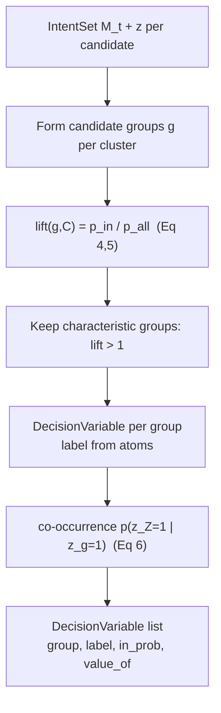

# Step 3 — Decision Variables (Grouping, Lift, Co-occurrence)

## Overview

Atomic features are useful internal discriminators but poor clarification
questions: individually they suffer **equivalence masking** (different atom sets
give the same output) and **interaction neglect** (meaning emerges only when atoms
are considered jointly). This step builds **grouped decision variables** `Z` that
are simultaneously good *functional* discriminators and *semantically
interpretable* (design requirements R1, R2). It also computes, for each decision
variable, which other atoms are **implicitly included** when it is present
(co-occurrence) — the information the Predicted Query panel (spec 14) uses to show
likely-final features.

## Paper grounding

- Motivation: "(1) Equivalence masking — vastly different atomic feature sets may
  yield functionally similar outputs; (2) Interaction neglect — meaningful
  differences can emerge when features are considered jointly … we aim to
  construct grouped decision variables that are both useful functional
  discriminators, while remaining semantically interpretable (R1, R2). Building on
  top of the clusters obtained in step 2, we extract the most characteristic
  features for each cluster." (p. 5, 3b).
- **Lift** (Eq. 4, 5, p. 5–6): for a group `g` and cluster `C`,
  - `p_in(g)  = #{a ∈ C : g ⊆ z(a)} / |C|`
  - `p_all(g) = #{a ∈ A : g ⊆ z(a)} / |A|`
  - `lift(g, C) = p_in(g) / p_all(g)`
  - "A lift greater than 1 means `g` is more prevalent *within* the cluster than
    expected from its global frequency, thus making it a *characteristic* set of
    features." (p. 6).
- **Co-occurrence** (Eq. 6, p. 6): to capture implicit dependencies,
  - `p(z_Z = 1 ∣ z_g = 1) = #{a ∈ A : z_g(a)=1 ∧ z_Z(a)=1} / #{a ∈ A : z_g(a)=1}`
  - where `z_g(a)` indicates query `a` contains feature group `g` and `z_Z(a)`
    indicates it contains feature `Z`. "This quantity represents the probability
    that `Z` is present given that `g` appears, thus identifying *implicitly
    included* variables." (p. 6).
- Iteration: after each user answer the surviving set is "reclustered, and the
  algorithm restarts at step 2" (p. 6, step 5) — so decision variables are
  **recomputed per turn** over the current candidate set (spec 08).

## Architecture

## Components

### Group formation

- File: `src/pleasqlarify/pipeline/decision_vars.py`.
- For each cluster `C` in `M_t`, form candidate feature groups `g` and score each
  by `lift(g, C)`. Retain groups with `lift > 1` as **characteristic** decision
  variables for that cluster. Build a `DecisionVariable` (spec 02) per retained
  group: `group` = atom indices, `label` = human rendering of the atoms,
  `value_of(m)` = whether cluster `m`'s members carry the group.
- Deduplicate decision variables that resolve to the same partition of `M_t`.

### Lift computation

- Implement Eq. 4/5 exactly against the frozen vocabulary. `g ⊆ z(a)` means every
  atom in `g` is set in `z(a)`. Guard `p_all(g) > 0` (a group present in some
  cluster is present in `A` by construction, so this holds for `g` drawn from
  members).

### Co-occurrence (implicit inclusion)

- Implement Eq. 6 exactly. For each decision variable, compute `in_prob` = the
  probability the variable's atoms are present given its group appears; more
  broadly, compute per-atom `p(atom ∣ current selections)` used by spec 14 to mark
  features as "likely included" (probability > 0) or "determined" (probability
  = 1, shown as `determined` in Figures 6/9).

## Core Assumptions & Undocumented Decisions

- **A8a — Group-formation algorithm.** The paper defines `lift(g, C)` for *a*
  group `g` but never says how the candidate groups `g` are enumerated (single
  atoms? all subsets? frequent itemsets?). This is the central gap of this step.
  - *Recommended default:* start from **single-atom groups** and **the maximal
    set of atoms shared by all members of a cluster** (the cluster's common
    signature), plus pairwise combinations of high-lift atoms. Retain those with
    `lift > 1`; this yields interpretable, non-trivial groups without exploding
    the subset lattice.
  - *Alternatives:* (a) frequent-itemset mining (e.g. FP-growth) over cluster
    members with a support threshold (principled, more parameters); (b)
    single-atoms only (misses "interaction neglect" the paper explicitly warns
    about); (c) all subsets (combinatorial blow-up). Flagged: defines what a
    grouped decision variable *is*.
- **A8b — Characteristic threshold.** Paper says "lift greater than 1." *Default:*
  strict `lift > 1`. *Alternative:* a margin `lift ≥ 1 + ε` to suppress
  near-global features; or top-`k` by lift per cluster (bounds the list length the
  UI must render — the study noted long atomic lists were effortful, spec 15).
- **A8c — "Feature Grouping" vs "Atomic" variants.** The eval compares
  `Clustering + EIG + Feature Grouping` against `Clustering + EIG + Atomic
  Features` (Figure 5). The **atomic variant uses single-atom decision variables**
  (`|g| = 1`); the **grouped variant uses the multi-atom groups above**. Both must
  be selectable via a flag (consumed by specs 07, 09, 10).
- **A8d — Co-occurrence threshold for "determined".** Figures 6/9 mark features as
  `determined` (probability 100%). *Default:* `in_prob ≥ 0.999` ⇒ determined;
  `0 < in_prob < 1` ⇒ likely-included (bordered in the UI). *Alternative:* a
  lower tunable threshold.

## Data Flow

`IntentSet M_t` + `z` per candidate → grouped `DecisionVariable`s (with `value_of`
partition of `M_t`) → ranked by information gain (spec 07) → surfaced in the
Decision Space (spec 13); co-occurrence probabilities → Predicted Query (spec 14).
Recomputed every turn over the filtered set (spec 08).

## Testing Strategy

- Unit: `lift` matches Eq. 4/5 on a hand-built fixture (`M_t`, `z` matrix) with
  known counts — assert exact float values.
- Unit: co-occurrence matches Eq. 6 on the same fixture, including the
  `in_prob = 1` (determined) case.
- Unit: a feature global to all candidates has `lift = 1` in every cluster and is
  **not** retained as characteristic.
- Unit: atomic vs grouped variant flag changes group sizes as specified.
- Contract: uses the golden `SessionState` fixture from spec 02.

## Acceptance Criteria

1. `decision_variables(session)` returns `DecisionVariable`s with correct `lift`
   and co-occurrence, for both atomic and grouped variants.
2. Eq. 4, 5, 6 are implemented verbatim and unit-verified against known counts.
3. `value_of` induces a valid partition of `M_t` (basis for spec 07's IG).
4. Assumptions A8a–A8d recorded before spec 07.
