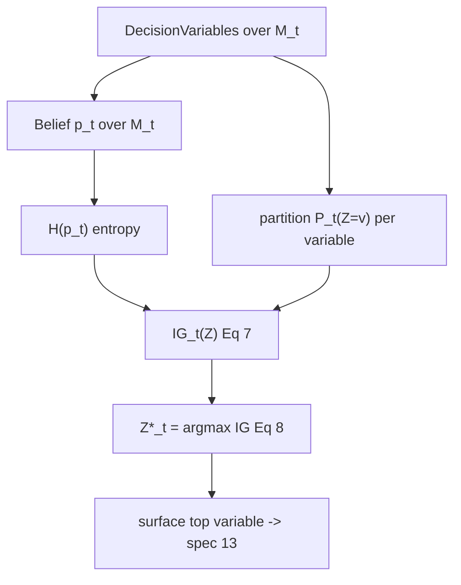

# Step 4 — Belief and Information-Gain Ranking of Decision Variables

## Overview

Following the pragmatic principle of *least collaborative effort* (design
requirement R3), the system asks the clarification that maximally reduces expected
uncertainty about the user's intent. This step maintains a **belief distribution**
`p_t(m)` over the surviving intents and ranks decision variables by **expected
information gain**, selecting the top one to surface (spec 13). It is the decision
criterion that makes the clustering-based strategy converge in few turns
(Figure 5).

## Paper grounding

- Candidate/belief: "let `M_t` be the set of intents that are still consistent
  with the user's clarifications at step `t`, and let `p_t(m)` be the current
  belief distribution over `M_t`." (p. 6, step 4).
- **Information gain** (Eq. 7, p. 6):
  - `IG_t(Z) = H(p_t) − Σ_{v ∈ V(Z)} P_t(Z=v) · H(p_t(· ∣ Z=v))`
  - `H(p_t) = − Σ_{m ∈ M_t} p_t(m) log p_t(m)` (Shannon entropy)
  - `P_t(Z=v) = Σ_{m ∈ M_t} p_t(m) · 1{Z(m)=v}`
- **Selection** (Eq. 8, p. 6): `Z*_t = argmax_Z IG_t(Z)`.
- Posterior update across turns (Eq. 3, p. 4):
  `p_{L,t}(m ∣ u, v_{1:t}) ∝ p_L(m ∣ u) · p_S(u ∣ m) · Π_{i=1}^{t} 1{Z_i(m)=v_i}`
  — i.e. conditioning on each answered decision variable zeroes out inconsistent
  intents and renormalizes.
- Two ranking baselines to contrast with (p. 7): "greedy decision variable
  selection, i.e., choosing the decision variable that splits on the value with
  the highest current posterior probability first" and "random decision variable"
  (see spec 09).

## Architecture

## Components

### Belief distribution `p_t(m)`

- File: `src/pleasqlarify/pipeline/belief.py`.
- Initialize `p_0(m)` over the initial clusters `M_0`. Update per Eq. 3 after each
  answer: keep only clusters consistent with the answered value, renormalize
  (spec 08 drives the turns).
- The prior `p_L(m ∣ u)·p_S(u ∣ m)` is approximated (see assumption A9).

### Information gain + ranking

- File: `src/pleasqlarify/pipeline/ranking.py`.
- Compute `H(p_t)`, and for each `DecisionVariable` compute `P_t(Z=v)` and the
  conditional entropies `H(p_t(·∣Z=v))`, then `IG_t(Z)` (Eq. 7). Rank all
  variables by `IG` descending; expose the full ranked list (the UI lets users
  step through with arrow keys, Figure 8) and `Z*_t = argmax` (Eq. 8). Store `ig`
  on each `DecisionVariable`.
- Use natural-log (nats) internally; unit consistent because IG is a difference.

## Core Assumptions & Undocumented Decisions

- **A9 — Belief initialization `p_0(m)` / the priors `p_L(m∣u)·p_S(u∣m)`.** The
  RSA framing (Section 3) defines these priors, but the algorithm never says how
  they are estimated for a concrete utterance.
  - *Recommended default:* **uniform over surviving functional clusters**,
    `p_0(m) = 1/|M_0|`. Simple, matches "the system may fail to estimate how well
    an utterance `u` distinguishes `m*`" (p. 4) — i.e. do not pretend to know the
    prior.
  - *Alternatives:* (a) **generation-frequency prior** — `p_0(m) ∝ Σ_{a∈m}
    gen_count(a)` (the LLM's sampling frequency as a proxy for `p_LM(a∣u)`),
    which is closer to "priors over intents" and is cheap since spec 03 records
    `gen_count`; (b) an LLM-scored prior. Flagged: changes which variable has
    max IG and thus the interaction path. Recommend implementing **both** uniform
    and frequency priors behind a flag (the eval, spec 10, can report both).
- **A10 — Intent = cluster (map `A → M`).** We take `M_t` = current clusters; each
  cluster is one intent (spec 02, M2). Belief lives over clusters, not raw
  actions. *Alternative:* belief over actions with intents as latent groups
  (heavier; no clear benefit given R2).
- **A11 — Value set `V(Z)`.** Binary `{contains, excludes}` per Figures 4/8.
  IG uses two terms in the sum. *Alternative:* multi-valued variables (e.g. which
  of several columns) — would generalize Eq. 7's sum but the paper's UI is binary.
- **A-rank-4 — Tie-breaking in argmax.** Not specified. *Default:* on equal IG,
  prefer the variable with the more balanced split (closer `P_t(Z=v)` to 0.5),
  then lexical by label, for determinism.

## Data Flow

`M_t`, `p_t`, decision variables → `IG` per variable → ranked list + `Z*_t` →
Decision Space (spec 13). After the user answers, spec 08 updates `p_t` (Eq. 3)
and reclusters; ranking reruns.

## Testing Strategy

- Unit: `H` and `IG` match hand-computed values on a fixture with known `p_t` and
  a known partition — assert exact floats.
- Unit: a variable that splits `M_t` 50/50 with uniform belief has higher IG than
  one that isolates a single intent; a variable constant over `M_t` has `IG = 0`.
- Unit: `argmax` selects the maximum-IG variable; tie-break rule is deterministic.
- Unit: belief update (Eq. 3) zeroes inconsistent clusters and renormalizes to 1.
- Contract: uses the golden `SessionState` fixture (spec 02); reused by spec 09
  to define the EIG baseline.

## Acceptance Criteria

1. `rank(session)` returns decision variables ordered by IG with `Z*_t` first.
2. Eq. 7 and Eq. 8 implemented verbatim, unit-verified against hand computation.
3. Belief supports uniform and generation-frequency initialization via a flag.
4. Assumptions A9–A11 recorded before spec 08/09.
