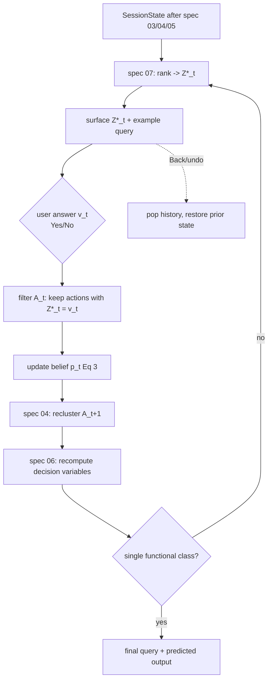

# Step 5 — Iterative Repair Loop (Filter, Recluster, Terminate)

## Overview

This spec ties steps 2–4 into the **turn-by-turn pragmatic-repair loop**: surface
the top decision variable, take the user's answer, filter the candidate set to the
consistent actions, recluster, recompute decision variables and belief, and repeat
until a single functional interpretation remains. This is the end-to-end
algorithmic contract the evaluation (spec 10) and the interface (specs 11–14) both
drive.

## Paper grounding

- "After the user provides feedback on decision variable `Z*_t`, we filter `A_t`
  to retain only actions consistent with the stated preference and update the
  belief distribution `p_t` accordingly. The reduced candidate set `A_{t+1} ⊂ A_t`
  is reclustered, and the algorithm restarts at step 2. This loop continues until
  a unique action remains in the candidate set." (p. 6, step 5).
- Iterative candidate filtering and query population is illustrated in Figure 4
  (p. 6): each turn shows the action space, the query-component probabilities, and
  the selected decision variable with a Yes/No answer, progressively shrinking the
  set.
- Refinement corresponds to conditioning the posterior on evidence (Eq. 3, p. 4);
  "Over successive turns, the candidate set narrows through targeted,
  pragmatically relevant repair moves" (p. 4).
- Termination in the interactive tool: "The interaction algorithm terminates once
  all remaining programs are functionally equivalent." (p. 6, Section 6 / Figure 6
  caption context) — i.e. a single *functional* class, not necessarily a single
  textual query.
- Reversibility: every decision can be reversed via a Back/undo (Figures 8, 9);
  the loop state must be a stack.

## Architecture

## Components

### Loop driver

- File: `src/pleasqlarify/pipeline/repair_loop.py`.
- Pure, UI-agnostic engine:
  - `next_variable(state) -> DecisionVariable | None` (None ⇒ terminated).
  - `apply_answer(state, variable, value) -> SessionState` — filters candidates by
    `variable.value_of`, updates belief (Eq. 3), reclusters (spec 04), recomputes
    decision variables (spec 06) and ranking (spec 07), pushes onto history,
    increments `turn`.
  - `undo(state) -> SessionState` — pops history (Figures 8, 9 Back button).
- The same driver is used by the simulated-user oracle (spec 10) and the backend
  (spec 11); only the *source of the answer* differs.

### Session facade

- File: `src/pleasqlarify/session.py`.
- `Session.start(sample)` runs specs 03→04→05→06→07 to build the initial state.
- Exposes the loop operations above plus read accessors used by the UI
  (`current_variable`, `predicted_query`, `predicted_output`, `action_space_view`).

### Termination

- Terminate when `|M_t| == 1` (a single functional cluster) OR when no decision
  variable has `IG > 0` (nothing left to distinguish). Emit the representative /
  most-probable query and its predicted output.

## Core Assumptions & Undocumented Decisions

- **A12 — Termination granularity.** Paper says both "a unique action remains"
  (p. 6, step 5) and "all remaining programs are functionally equivalent" (p. 6,
  Section 6). These differ: the second stops earlier (a functional class may hold
  several textual queries).
  - *Recommended default:* terminate on **single functional class** (`|M_t| = 1`)
    — matches the interactive-tool statement and R2 (intents, not textual
    variants, are what matter). *Alternative:* continue to a single textual query
    (needed only if the user must pick an exact SQL string). Flagged.
- **A12b — Recluster `k` after filtering.** Reclustering the smaller set needs a
  `k`. *Default:* reuse spec 04's threshold-based `k` on the filtered set (data-
  driven, so `k` shrinks naturally). *Eval:* in gold-`k` mode, recompute against
  remaining gold intents (spec 10).
- **A12c — Belief carry-over vs recompute.** After reclustering, cluster identities
  change. *Default:* recompute belief on the new clusters from the surviving
  members' priors (Eq. 3 applied to the new partition), rather than trying to map
  old cluster ids forward. *Alternative:* stable cluster ids across turns
  (harder; not needed).
- **A12d — No-progress guard.** If an answer fails to shrink `M_t` (degenerate
  variable), skip and pick the next-ranked variable to avoid infinite loops.

## Data Flow

Initial `SessionState` → (rank → ask → answer → filter → update belief →
recluster → recompute variables)* → terminal state with final query + predicted
output. History stack enables undo.

## Testing Strategy

- Unit: `apply_answer` monotonically shrinks (or holds) `|M_t|`; belief stays
  normalized; history grows by one; `undo` restores the exact prior state.
- Unit: termination fires at `|M_t| = 1` and when all IG = 0.
- Integration (deterministic, mocked LLM + fixture DB): from a seeded
  `ActionSpace` with 2 gold intents, answering the top variable each turn reaches
  the correct single intent in a bounded number of turns.
- Integration: full loop against one AMBROSIA sample using cached generations
  converges to a gold interpretation (ties spec 03–07 together end-to-end).
- Property: replaying the same answers yields the same trajectory (determinism).

## Acceptance Criteria

1. A pure loop engine drives steps 2–4 to termination and supports undo.
2. `Session` exposes start/next/answer/undo and the UI read accessors.
3. End-to-end deterministic test converges to a gold intent on a cached sample.
4. Assumptions A12–A12d recorded; termination default (single functional class)
   is used consistently by specs 10 and 11.
