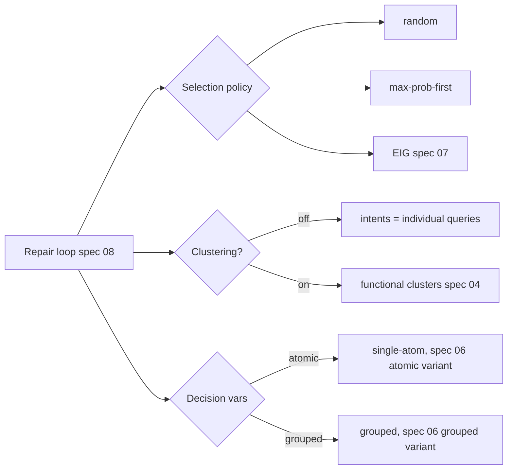

# Evaluation Conditions — Baselines and "Ours" Variants

## Overview

The quantitative evaluation (spec 10, Figure 5) compares five disambiguation
strategies. This spec defines each as a swappable **decision-variable selection
policy** plugged into the same repair loop (spec 08), so the harness runs all five
identically and the only difference is the policy. The five conditions form a
clean ablation: baselines isolate *selection policy*, the ours-atomic-vs-baseline
comparison isolates *functional clustering*, and the ours-grouped-vs-atomic
comparison isolates *feature grouping*.

## Paper grounding

- Baselines (p. 7, Setup): "we implement (1) random decision variable choice,
  (2) a greedy decision variable selection, i.e., choosing the decision variable
  that splits on the value with the highest current posterior probability first,
  and (3) expected information gain without functional clustering."
- Ours (p. 7): "We compare these to two variants of our clustering-based algorithm
  (atomic vs. grouped decision variables)."
- Figure 5 legend names the five: `Baseline ERG + Atomic Features`,
  `Baseline Random + Atomic Features`, `Baseline Max-Prob-First + Atomic
  Features`; `Ours: Clustering + EIG + Atomic Features`, `Clustering + EIG +
  Feature Grouping`.

## The five conditions

| Condition (legend) | Clustering? | Decision-variable set | Selection policy |
|---|---|---|---|
| Baseline Random + Atomic | No (intents = individual queries) | atomic (single-atom) | pick a random variable |
| Baseline Max-Prob-First + Atomic | No | atomic | greedy: split on the value with highest current posterior first |
| Baseline ERG + Atomic (see A16) | No | atomic | expected information gain (Eq. 7) |
| Ours: Clustering + EIG + Atomic | **Yes** (spec 04) | atomic | expected information gain (Eq. 7) |
| Ours: Clustering + EIG + Feature Grouping | **Yes** | **grouped** (spec 06) | expected information gain (Eq. 7) |

## Architecture

## Components

- File: `src/pleasqlarify/eval/conditions.py`.
- `SelectionPolicy` interface: `select(session) -> DecisionVariable`. Three
  implementations: `RandomPolicy`, `MaxProbFirstPolicy`, `EIGPolicy` (wraps spec
  07's ranking).
- `Condition` = `(clustering: bool, variable_mode: {atomic, grouped}, policy)`.
  When `clustering=False`, the loop treats **each candidate query as its own
  intent** (`M_t` = surviving queries), so belief and metrics are defined over
  queries rather than clusters. When `clustering=True`, `M_t` = functional
  clusters (spec 04).
- The five conditions are constructed from these axes; the grouped mode is only
  paired with clustering (matching the paper's five, not the full cross-product).

### Selection policies

- **Random:** uniformly sample among decision variables with `IG > 0`
  (seeded for reproducibility).
- **Max-Prob-First (greedy):** choose the variable whose most-probable value has
  the highest posterior mass `max_v P_t(Z=v)` — i.e. confirm the currently most-
  likely branch first (a myopic, non-information-theoretic heuristic).
- **EIG:** `argmax IG_t(Z)` from spec 07 (Eq. 8).

## Core Assumptions & Undocumented Decisions

- **A16 — "ERG" (legend) vs "expected information gain without functional
  clustering" (text).** Figure 5's legend says `ERG` while the Setup text lists
  the third baseline as EIG-without-clustering. **RESOLVE-ME.** Most likely they
  are the same condition ("ERG" possibly meaning *Expected Reduction* of entropy /
  a labeling slip for EIG). *Recommended default:* implement the third baseline as
  **EIG applied to atomic features without clustering**, and label it `ERG` in
  plots to match the figure, with a code comment flagging the ambiguity.
  *Alternative to check:* ERG denotes a distinct "expected reduction" criterion
  (e.g. expected reduction in candidate count rather than entropy) — implement as
  a variant if the authors confirm.
- **A16b — No-clustering intent granularity.** "Without functional clustering"
  could mean (a) each query is its own intent, or (b) intents are still the gold
  labels but variables are atomic. *Recommended default:* (a) each surviving query
  is its own intent for baselines; gold labels are used only by the *metric* (spec
  10), not by the baseline's internal belief. Flagged.
- **A16c — Max-Prob-First value definition.** "Highest current posterior
  probability" is ambiguous between highest-probability *value* of a variable vs
  highest-probability *intent* it confirms. *Default:* highest `P_t(Z=v)` over the
  variable's values (as tabled above). Flagged.

## Testing Strategy

- Unit: each policy returns a valid decision variable from the current set;
  Random is reproducible under a fixed seed.
- Unit: with `clustering=False`, `M_t` equals the surviving-query set; with
  `clustering=True`, it equals the cluster set.
- Unit: EIGPolicy returns the same variable as spec 07's `argmax` on a fixture.
- Integration: all five conditions run to termination on a cached sample without
  error and produce a per-turn trajectory (consumed by spec 10).

## Acceptance Criteria

1. Five named conditions are constructed and runnable through the spec 08 loop.
2. Selection policies match the paper's descriptions; Random is seeded.
3. A16/A16b/A16c are recorded; the `ERG`/EIG decision is documented in code.
