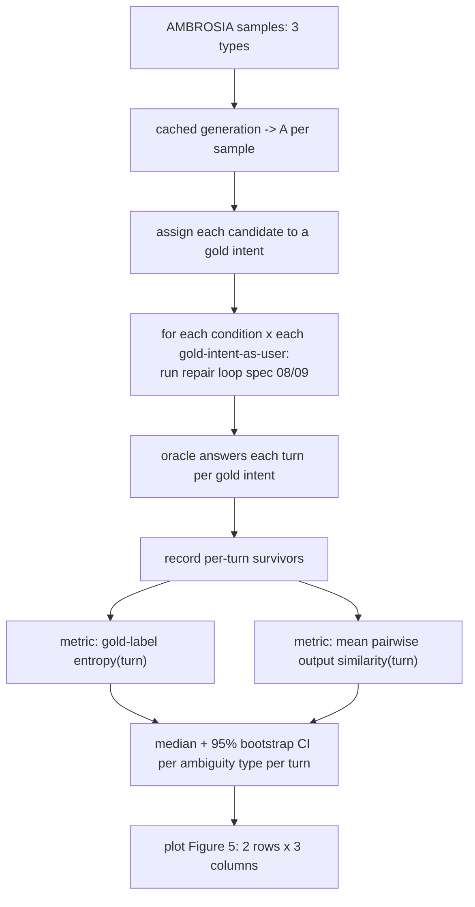

# Quantitative Evaluation on AMBROSIA (Reproduce Figure 5)

## Overview

This is the paper's central quantitative result: across three AMBROSIA ambiguity
types, the two clustering-based strategies resolve uncertainty in fewer turns than
the baselines. This spec defines the **simulated-user oracle**, the **gold-intent
assignment**, the two **per-turn metrics** (gold-label entropy and functional
output similarity), the **bootstrap confidence intervals**, and the harness that
reproduces **Figure 5** (six panels: entropy and similarity × {Attachment, Vague,
Scope}). This spec carries disproportionate weight — it *is* the reproducible
research claim.

## Paper grounding

- Setup (p. 7): per sample, generate `A` via GPT-4o `N=50 @ T=0.7`; extract AST;
  build feature matrix; build output-similarity `S` via execution + `all-MiniLM-
  L6-v2`; cluster hierarchically. "As the dataset provides two (or more) gold
  interpretations per sample, we can additionally assign each generated candidate
  query to either of the high-level gold intents."
- Simulated user (p. 7–8): "We compare two variants … by selecting one of the gold
  labels as the user intent and choosing the decision variable value that agrees
  with their intent. The interaction algorithm terminates once all remaining
  programs are functionally equivalent."
- Metrics (p. 8): "The top row reports the median gold-label entropy over the
  candidate meaning distribution, a direct measure of residual semantic
  uncertainty. The bottom row tracks the median functional similarity within the
  remaining candidate set, reflecting how tightly the surviving queries cluster in
  execution space."
- Results (p. 8): clustering-based strategies "achieve steeper entropy declines,
  reaching low uncertainty levels in fewer turns, and attain higher within-branch
  functional similarity earlier"; grouped features "rapidly collapses the
  hypothesis space—often to a functionally homogeneous set—within three to five
  turns."
- Figure 5: median per-turn curves with **95% bootstrap CIs**, turn index shown
  from 2 to 10.
- Cost note (Limitations, p. 15): "with optimal clarification behavior and a fixed
  candidate pool—takes two to eight clarification steps until converging on the
  target query. Resampling 50 model outputs at each step would therefore require
  up to 400 API calls" — confirms the **fixed pool** (no resampling per turn) used
  in the eval.

## Architecture

## Components

### Simulated-user oracle

- File: `src/pleasqlarify/eval/oracle.py`.
- For a chosen gold intent `g*` (one gold query), answer each surfaced decision
  variable `Z*_t`: `answer = value_of_gold(Z*_t, g*)` — whether the gold query
  carries the decision variable's group (contains → Yes, excludes → No). This is
  the "choosing the decision variable value that agrees with their intent" rule.
- Run once per gold intent per sample (each interpretation plays the user).

### Gold-intent assignment

- Assign every generated candidate to the nearest gold intent so the "gold-label
  distribution" over survivors is well-defined.
- *Rule (A14):* execute the candidate and each gold query on the sample DB; assign
  the candidate to the gold intent with **maximum functional output similarity**
  (same embedding + cosine as spec 04). Ties → the higher-`gen_count`-consistent
  gold.

### Metrics

- File: `src/pleasqlarify/eval/metrics.py`.
- **Gold-label entropy at turn `t`:** over the surviving candidates `M_t`, form the
  distribution `q_t(g)` = fraction of survivors assigned to gold intent `g`
  (weighted by belief if clustering is on; by count if off — see A15). Report
  `H(q_t) = −Σ_g q_t(g) log q_t(g)`. Converges to 0 when survivors are all one
  gold intent.
- **Functional output similarity at turn `t`:** mean pairwise `S(a_i, a_j)` over
  surviving candidates (the same `S` from spec 04). Converges to 1 when survivors
  are functionally homogeneous.

### Aggregation + bootstrap CIs

- Per ambiguity type and per turn index, aggregate across (sample × gold-intent)
  runs: report the **median** and a **95% bootstrap CI** (resample runs with
  replacement, e.g. 10 000 iterations, percentile interval). Align turns on a
  common index; handle runs that terminate early (see A15b).

### Harness + plot

- Files: `src/pleasqlarify/eval/run_benchmark.py`, `plot_figure5.py`.
- Iterate: ambiguity types × samples × 5 conditions (spec 09) × gold-intents.
  Uses the **fixed candidate pool** (no per-turn resampling). Emit a tidy results
  table (condition, type, sample, gold, turn, entropy, similarity) and render the
  2×3 Figure 5 with CI bands.

## Core Assumptions & Undocumented Decisions

- **A13 — Oracle answering policy.** Paper: "choosing the decision variable value
  that agrees with their intent." *Default:* Yes iff the gold query's `z` contains
  the variable's atom group (spec 06 `value_of` on the gold query). *Alternative:*
  answer by which side the gold *intent's cluster* falls on (relevant when the
  gold query isn't itself among the candidates). Flagged; both should agree when
  the gold query is representable by the vocabulary.
- **A14 — Gold-intent assignment rule.** Undocumented. *Default:* max functional
  output similarity (execution-based), above. *Alternatives:* (a) exact set-equal
  of result rows; (b) assign by which gold query the candidate's cluster is
  closest to. Flagged: defines the label distribution the top-row metric measures.
- **A15 — Exact metric definitions.** "Gold-label entropy over the candidate
  meaning distribution" is defined here as Shannon entropy of the survivor→gold
  distribution `q_t`; weighting (belief vs count) is unstated. *Default:* count-
  based `q_t` for a policy-agnostic comparison across all five conditions (so
  baselines without belief are comparable); also emit a belief-weighted variant.
  Flagged.
- **A15b — Turn alignment & early termination.** Runs converge at different turns
  (2–8 per Limitations). *Default:* once a run terminates, carry its final value
  forward (entropy 0 / similarity 1) to the max turn index so medians at later
  turns are well-defined; document this as forward-fill. *Alternative:* drop
  terminated runs from later turns (changes the tail of the curves). Flagged.
- **A15c — Turn index origin.** Figure 5 x-axis starts at 2. *Default:* turn 1 =
  initial state (before any answer); plot from turn 1 but match the paper's 2–10
  window. Flagged as cosmetic.
- **A16 (from spec 09) — ERG vs EIG label.** Carried here for the plot legend.

## Testing Strategy

- Unit: entropy and similarity metrics match hand-computed values on a fixture set
  of survivors with known gold assignments.
- Unit: oracle answers a fixture decision variable correctly for a given gold
  query (Yes when contained, No when excluded).
- Unit: bootstrap CI on a fixed-seed sample matches a precomputed interval.
- Integration (cached generations, no live API): run all five conditions on a
  small AMBROSIA subset; assert the **qualitative** paper claim — clustering-based
  conditions reach entropy ≤ baseline at matched turns, and grouped converges
  within ~3–5 turns on average.
- Regression: the tidy results table is byte-stable across runs given fixed seeds
  and cached generations.

## Acceptance Criteria

1. `run_benchmark` produces a tidy per-turn results table for all five conditions
   across the three ambiguity types, using the fixed candidate pool.
2. `plot_figure5` renders the 2×3 median curves with 95% bootstrap CIs.
3. The integration test confirms the directional result (clustering ≥ baselines;
   grouped converges in a few turns).
4. Assumptions A13–A16 recorded with chosen defaults; the ERG/EIG label decision
   is visible in the legend and code.
