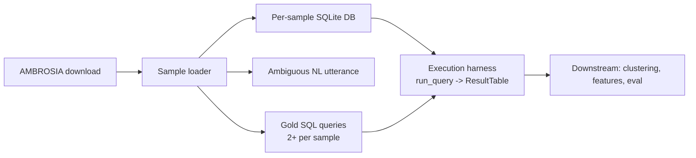

# Environment, Dependencies, and AMBROSIA Data Harness

## Overview

Everything downstream — candidate generation, functional clustering, feature
extraction, evaluation, and the interface — runs against the **AMBROSIA** dataset
and executes SQL against **per-sample SQLite databases**. This spec pins the
Python environment, the third-party libraries the paper names, the AMBROSIA
acquisition procedure, and a deterministic SQL execution harness. It is the
foundation the rest of the deck assumes.

## Paper grounding

- Evaluation and user-study data both come from AMBROSIA (Sparapata & Lapata,
  ref [35]), a text-to-SQL benchmark with three ambiguity types — *scope*,
  *attachment*, and *vagueness* (p. 7, p. 11).
- Each AMBROSIA sample ships "a small database of around 5 tables, each with < 10
  rows and columns per table" (p. 11), and "at least two high-level semantic
  interpretations, for which the corresponding gold SQL queries can be used"
  (p. 11). Limiting DB size "enables a controlled quantitative evaluation … it
  allowed participants … within a reasonable time frame" (p. 15).
- Named libraries: the **Spider SQL parser** (ref [42]) to build the AST
  (p. 7); **`all-MiniLM-L6-v2`** (ref [34]) for output embeddings (p. 7);
  **hierarchical clustering** (ref [16]) (p. 7); **UMAP** (ref [25]) for the
  Action Space projection (p. 9); **Voronoi diagrams** (ref [1]) (p. 9).
- Candidate generation uses **GPT-4o** (ref [30]) in the evaluation (p. 7).

## Architecture

## Components

### Environment and dependency pinning

- File: `pyproject.toml` (or `requirements.txt`). Python **3.11**.
- Core deps: `datasets` (HuggingFace, for AMBROSIA), the Spider parser
  (`process_sql.py` from the Spider repo, vendored — it is not on PyPI),
  `sentence-transformers` (provides `all-MiniLM-L6-v2`), `scikit-learn`
  (hierarchical clustering, metrics), `scipy`, `numpy`, `umap-learn`, `openai`
  (candidate generation), `sqlglot` (a secondary, robust SQL parser used as a
  fallback/normalizer — see spec 05), `pytest`.
- Pin exact versions in a lockfile so replication is reproducible.

### AMBROSIA loader

- File: `src/pleasqlarify/data/ambrosia.py`.
- Loads AMBROSIA (via HuggingFace `datasets`, dataset id resolved from ref [35];
  see assumption **F1**). Exposes an iterator of `AmbrosiaSample`:
  - `sample_id: str`
  - `ambiguity_type: Literal["scope", "attachment", "vague"]`
  - `utterance: str` (the ambiguous NL question)
  - `db_path: str` (path to the sample's SQLite file)
  - `schema: DbSchema` (tables, columns, types, FKs — parsed once)
  - `gold_queries: list[GoldQuery]` where `GoldQuery = {intent_label, sql}`
    (≥ 2 per sample).
- Provides filtered views used later: the eval set (all samples of the three
  types) and the user-study subset (Filmmaking domain: 2 vague, 2 attachment, 1
  scope — p. 11).

### SQL execution harness

- File: `src/pleasqlarify/data/execution.py`.
- `run_query(db_path, sql) -> ResultTable` opens the sample SQLite DB read-only
  and executes `sql`. `ResultTable` captures ordered column names, rows, row and
  column counts, and an `error` field.
- Deterministic: enforce a stable row ordering when the query has no `ORDER BY`
  (sort rows lexicographically post-hoc) so two structurally different queries
  with identical result *sets* serialize identically downstream (see spec 04,
  assumption A3). Timeout each query (e.g. 5 s) to bound pathological cases.

## Data Flow

Download AMBROSIA once → materialize each sample's SQLite DB on disk → loader
yields `AmbrosiaSample` → downstream specs call `run_query` for both generated
candidates and gold queries against the *same* per-sample DB.

## Core Assumptions & Undocumented Decisions

> Paper-first: the paper names the dataset and libraries but not the acquisition
> mechanics or execution semantics. Defaults below are ours and flagged.

- **F1 — AMBROSIA dataset id / version.** The paper cites ref [35] (NeurIPS D&B
  2024) but not a concrete HuggingFace id or split.
  - *Recommended default:* resolve the canonical HF dataset from the paper's
    OpenReview link and pin its commit hash in the lockfile.
  - *Alternatives:* mirror the release tarball into `data/ambrosia/` and load
    from disk (more reproducible, larger repo).
- **F2 — DB engine.** Paper says "test database" but not the engine.
  - *Recommended default:* **SQLite**, matching AMBROSIA's distribution format
    and the "small database" framing. *Alternative:* DuckDB (faster, but risks
    dialect drift vs. the gold queries).
- **F3 — Result-set determinism for unordered queries.** The paper's functional
  similarity (spec 04) compares outputs; SQL result order is undefined without
  `ORDER BY`.
  - *Recommended default:* canonicalize by sorting rows before serialization.
  - *Alternative:* treat output as a multiset and embed a canonical multiset
    string. Flagged because it materially affects the similarity matrix `S`.
- **F4 — Handling gold queries with >2 interpretations.** Paper says "two (or
  more)" (p. 7). *Default:* keep all gold intents; the eval (spec 10) computes
  entropy over however many exist.

## Testing Strategy

- Unit: `run_query` returns correct row/column counts on a fixture DB; errors are
  captured (not raised) for malformed SQL; timeout triggers on a crafted query.
- Unit: canonical ordering makes two logically-equal unordered queries produce
  byte-identical serializations.
- Integration: load ≥ 3 AMBROSIA samples (one per ambiguity type), confirm each
  has ≥ 2 gold queries, a valid SQLite DB, and that every gold query executes
  without error.
- Sanity: gold queries for the same sample produce *different* outputs (they
  encode different intents) — a guard against a broken loader.

## Acceptance Criteria

1. `pip install` / `uv sync` from the lockfile reproduces the environment.
2. The loader yields typed `AmbrosiaSample`s for all three ambiguity types.
3. `run_query` executes gold queries deterministically with captured errors.
4. All assumptions F1–F4 are resolved with a recorded decision before spec 04 is
   implemented.
