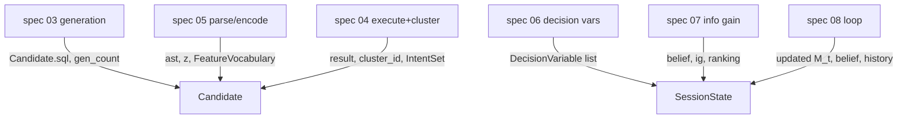

# Shared Data Model and Notation (Keystone)

## Overview

The Section 5 pipeline is a chain: each step consumes the previous step's
structures. The atomic feature vector `z` (spec 05) defines what a decision
variable is (spec 06), which defines the information-gain computation (spec 07),
which the evaluation measures (spec 10). If each spec invented its own types they
would not compose. **This spec pins one canonical object model and notation that
every downstream spec references.** No behavior lives here — only the shared
contract.

## Paper grounding (notation dictionary)

From Sections 3–5 (pp. 3–6):

| Symbol | Meaning | Paper ref |
|---|---|---|
| `u` | The user's (ambiguous) natural-language utterance | p. 3, Eq. 1 |
| `m*` | The user's intended meaning / intent | p. 3 |
| `M` | The set of intents (meanings) | p. 3–5 |
| `A = {a_1,…,a_N}` | The **action space**: candidate executable actions (here, SQL queries) | p. 5 |
| `m(a, C)` | Functional outcome of executing action `a` in context (database) `C` | p. 5 |
| `S(a_i, a_j)` | Functional similarity between two actions (≈1 ⇒ equivalent) | p. 5 |
| `z(a) ∈ {0,1}^d` | **Atomic feature vector**: binary presence of each atomic action component | p. 5 |
| `g` | A *group* of atomic features | p. 5, Eq. 4 |
| `lift(g, C)` | Prevalence of group `g` within cluster `C` vs. globally | p. 5–6, Eq. 5 |
| `Z_t : M_{t-1} → V_t` | **Decision variable** at turn `t`; maps intents to a value set `V_t` | p. 4, p. 6 |
| `M_0 = {m : p_L(m∣u) > 0}` | Initial candidate intent set | p. 4 |
| `M_t = {m ∈ M_{t-1} : Z_t(m) = v_t}` | Candidate set after the user's turn-`t` answer | p. 4 |
| `p_t(m)` | Belief distribution over intents at turn `t` | p. 6, Eq. 7 |
| `IG_t(Z)` | Expected information gain of decision variable `Z` at turn `t` | p. 6, Eq. 7 |

## Canonical types

File: `src/pleasqlarify/model/types.py`. These are the shared structures; each
downstream spec adds behavior that produces or consumes them.

### Candidate action `a` and the action space `A`

```
Candidate:
  id: str
  sql: str                     # the raw generated query
  ast: SqlAst                  # parsed AST (spec 05)
  z: BitVector                 # atomic feature vector z(a) in {0,1}^d (spec 05)
  result: ResultTable | None   # m(a, C): execution output (spec 01/04)
  cluster_id: int | None       # functional cluster assignment (spec 04)
  gen_count: int               # #times sampled (informs priors; spec 03)

ActionSpace = list[Candidate]  # A
```

### Atomic feature vocabulary (the `d` dimensions of `z`)

The vocabulary is **built per session** from the union of atoms across the
current candidate set (it is not a fixed global vocabulary), then frozen for the
session so every `z` shares an index space.

```
AtomicFeature:
  index: int                   # dimension in z
  kind: enum { SELECT_COL, SELECT_STAR, AGG, DISTINCT, FROM_TABLE, JOIN,
               WHERE_PRED, GROUP_BY, ORDER_BY, HAVING, LIMIT, ... }  # spec 05
  payload: str                 # canonical rendering, e.g. "SELECT Opinion",
                               # "WHERE Genre = 'Drama'"

FeatureVocabulary:
  features: list[AtomicFeature]     # index-ordered; |features| = d
  encode(ast) -> BitVector          # produces z for a candidate
```

### Functional cluster / intent `m` and intent set `M`

Per Section 5 step 2 and R2 (functionally equivalent actions realize the same
intent), we treat **one functional cluster as one intent** `m` (see spec 07,
assumption A10).

```
Cluster:            # == an intent m
  id: int
  member_ids: list[str]        # candidate ids in this cluster
  representative_id: str       # example query surfaced in the UI (spec 13)

IntentSet = list[Cluster]      # M_t (the current candidate set)
```

### Decision variable `Z` and its value set

Per Figures 4/8 the value set is binary (a query *contains* or *excludes* the
variable). See assumption A11.

```
DecisionVariable:              # Z_t
  id: str
  group: list[int]             # indices of the grouped atomic features g (spec 06)
  label: str                   # human-readable, e.g. "SELECT Opinion"
  value_of(m: Cluster) -> bool # Z_t(m): does intent m carry this group?
  ig: float                    # expected information gain (spec 07)
  in_prob: float               # implicit-inclusion probability (spec 06, Eq. 6)
```

### Belief and session state

```
Belief = dict[cluster_id, float]     # p_t(m); sums to 1 over M_t

SessionState:
  utterance: str
  vocabulary: FeatureVocabulary
  candidates: ActionSpace              # frozen A (spec 03)
  clusters: IntentSet                  # M_t, updated each turn (spec 04/08)
  belief: Belief                       # p_t (spec 07)
  turn: int
  history: list[(DecisionVariable, bool)]  # answered variables (spec 08)
```

## Data Flow (who produces what)



## Core Assumptions & Undocumented Decisions

- **M1 — Vocabulary scope (per-session vs global).** The paper's `z ∈ {0,1}^d`
  implies a fixed `d`, but never says whether `d` spans a global vocabulary or
  the session's candidates.
  - *Recommended default:* per-session vocabulary, frozen after generation. It
    keeps `d` small and interpretable and matches the per-utterance framing.
  - *Alternative:* global vocabulary over the DB schema (stable indices across
    sessions; larger, sparser `z`). Flagged: affects lift/co-occurrence denominators.
- **M2 — Intent = cluster.** The paper distinguishes `A` (actions) from `M`
  (intents) and says functionally-equivalent actions share an intent, but never
  gives the map explicitly. We fix **one intent per functional cluster**; owned
  and re-examined in spec 07 (A10).
- **M3 — Binary value set `V_t`.** Figures 4/8 show contains/excludes; we encode
  `Z_t(m) ∈ {true,false}`. Multi-valued variables (e.g. which of 3 columns) are
  out of scope; re-examined in spec 07 (A11).

## Testing Strategy

- Unit: `FeatureVocabulary.encode` is deterministic and index-stable across
  calls within a session.
- Unit: round-trip — building `M_t` from clusters and reducing by a
  `DecisionVariable.value_of` yields a subset (never grows).
- Contract: a golden fixture `SessionState` (hand-built) that spec 06/07/08 tests
  import, so downstream math is checked against one shared object.

## Acceptance Criteria

1. All downstream specs (03–15) import these types and add no competing
   definitions of `A`, `z`, `M`, `Z`, or `p_t`.
2. The notation table matches the paper's symbols exactly.
3. Assumptions M1–M3 are recorded and cross-linked to their owning specs.
