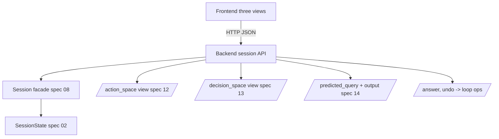

# Visual Interface — Backend Session API

## Overview

The visual interface (Section 8) is a research tool that surfaces the algorithm's
state: the Action Space (spec 12), Decision Space (spec 13), and Predicted Query /
Predicted Output (spec 14). All three are views over one `SessionState` (spec 02)
driven by the repair loop (spec 08). This spec defines the **backend contract**
they share: a small stateful HTTP+JSON API that starts a session, returns each
view's data, applies a decision, and supports undo. Defining it once keeps the
three view specs consistent.

## Paper grounding

- "we build a visual interface that aims to (1) surface the system's probable
  action space `A` by visualizing a semantically clustered representation of the
  remaining candidate set `M_t` at each decision step `t` (R1), (2) make user
  decisions more interpretable … (R2), and (3) support efficient intent
  clarification with minimal iterations (R3)." (p. 8).
- The interface has an utterance field (1) and three analysis views: Action Space
  (2), Decision Space (3), Predicted Query (4), plus Predicted Output (5)
  (Figure 6, p. 8).
- Views are interlinked: "a user's interaction in one view triggers corresponding
  updates in the others." (p. 9). Accepting/rejecting a decision variable filters
  the Action Space and updates the Predicted Query (Figure 8). Every decision is
  reversible via Back/undo (Figure 9).
- "primarily built as a research tool" (p. 8); the hosted instance is
  `sql-ambiguity.ivia.ch` (p. 1).

## Architecture

## API Surface

Session-scoped; `session_id` returned on start. All responses are JSON.

| Method | Route | Purpose |
|---|---|---|
| `POST` | `/session` | Start a session: body `{utterance, sample_id}` (or `{utterance, schema, db}`). Runs specs 03→07. Returns `session_id` + full initial `StateView`. |
| `GET` | `/session/{id}/action_space` | Action Space payload (spec 12): UMAP 2-D coords, Voronoi cells, per-query glyph descriptors, cluster colors. |
| `GET` | `/session/{id}/decision_space` | Ranked decision variables (spec 13): label, atoms, IG, example query, current top `Z*_t`. |
| `GET` | `/session/{id}/predicted_query` | Predicted Query (spec 14): atomic features with probabilities + `determined` flags, and the predicted output table. |
| `POST` | `/session/{id}/answer` | Body `{variable_id, value: bool}`. Applies `apply_answer` (spec 08). Returns updated `StateView`. |
| `POST` | `/session/{id}/undo` | `undo` (spec 08). Returns previous `StateView`. |
| `POST` | `/session/{id}/select` | Direct Action-Space selection (click/cluster/lasso, spec 12): body `{query_ids}` → filters candidates and returns updated `StateView`. |

`StateView` bundles `turn`, `terminated`, and the three view payloads so the UI
can refresh all linked views from one response.

## Components

- File: `src/pleasqlarify/server/app.py` — the HTTP app and routes.
- File: `src/pleasqlarify/server/schemas.py` — request/response models mirroring
  spec 02 types (serialization only; no algorithm logic here).
- Session store: in-memory dict `session_id → Session` (research tool, single
  process). Sessions expire after inactivity.
- View builders live with their specs (12/13/14); the server just calls them.

## Core Assumptions & Undocumented Decisions

- **A-be-1 — Tech stack.** The paper shows only a hosted web tool; no stack is
  documented.
  - *Recommended default:* **Python + FastAPI** backend (reuses the algorithm code
    directly, no cross-language port) with a browser frontend (spec 12 uses
    D3/Canvas for UMAP+Voronoi). *Alternatives:* a notebook/Streamlit prototype
    (fast, less faithful to Figures 6–9); a full JS port (faithful UI, duplicates
    the algorithm). Flagged.
- **A-be-2 — State transport.** Recompute-and-return-full-`StateView` vs
  incremental diffs. *Default:* return full `StateView` on each mutation (simpler,
  the candidate set is small ≤ 50). *Alternative:* diffs / websockets for
  animation (nice-to-have).
- **A-be-3 — Persistence / logging.** The user study needs interaction traces
  (spec 15). *Default:* append-only JSONL event log per session
  (`data/sessions/{id}.jsonl`) capturing every request/answer/undo with
  timestamps, so study workflows (Figure 11) can be reconstructed. Not in the
  paper but required by the study.

## Testing Strategy

- Unit: schema (de)serialization round-trips every spec 02 type.
- Integration: `POST /session` → `POST /answer` (top variable) → state shrinks;
  `POST /undo` restores; against a cached-generation sample.
- Integration: the three GET views are mutually consistent after an answer (same
  `turn`, same surviving set) — guards the "linked views" property.
- API contract test: response shapes match `schemas.py` (used by the frontend
  specs 12–14).

## Acceptance Criteria

1. The API starts a session, serves all three views, applies answers, and undoes.
2. One `answer` updates all linked views consistently in a single response.
3. Per-session JSONL event logging is in place for study trace capture.
4. A-be-1..3 recorded; the FastAPI + browser default is used by specs 12–14.
