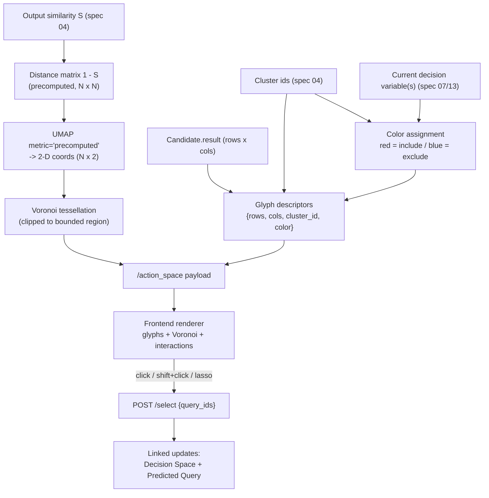

# Visual Interface — Action Space View

## Overview

The Action Space view is analysis view (2) of the interface (Figure 6, p. 8). Its
purpose is to give users "an overview of all possible system actions, i.e.,
LLM-generated queries for the given user's utterance, and to enable users to
selectively filter queries for relevance" (p. 9) — i.e. it surfaces the system's
probable action space `A` / remaining candidate set `M_t` in service of
requirement **R1** and supports data exploration. It renders the queries as a
UMAP 2-D projection of glyphs, each enclosed in a colored Voronoi cell, and lets
the user click, shift-click, or lasso queries to drive linked updates in the
Decision Space and Predicted Query views.

## Paper grounding

- **Role.** "The primary objective of the *Action Space* is to assist users in
  exploring alternative interpretations and manually filtering queries to those
  that are most relevant." (p. 9). It surfaces the probable action space `A` /
  remaining candidate set `M_t` (R1, p. 8).
- **UMAP on the distance matrix.** "The two-dimensional positions of the glyphs
  are determined by applying the UMAP projection algorithm [25] to the *distance
  matrix* of queries, the calculation of which is explained in Section 5." (p. 9).
  The distance is `1 − S`, the functional output-similarity distance from
  Section 5 / spec 04 (not raw features). Figure 7 caption: "The *Action Space* is
  a UMAP projection of the SQL queries visualized as glyphs and surrounded by
  Voronoi cells." (p. 9).
- **Glyph mimics the output table.** "each individual query is represented through
  a glyph that mimics its output table from the database … a query is represented
  by a glyph, which mimics its output table retrieved from the database (number of
  rows and columns, scaled to a maximum size of 50 px). The glyphs are intended to
  emphasize only the presence of output differences; thus, users are not expected
  to examine precise row and column counts, which would be difficult for larger
  tables." (p. 9).
- **Global binary color encoding.** "We use a global binary color encoding to make
  the impact of the decisions apparent. We use a red shade instead of light gray
  to represent the atomic features that act as current decision variables … we use
  a red color scale to color queries (i.e., query glyphs) that would be filtered
  if the user accepts the suggested decision variable, whereby the different shades
  of red represent different clusters determined by our algorithm (see Section 5).
  Red was selected because previous research indicates that this color functions as
  a signal of relevance, conveying that a stimulus is important and merits
  attention [3]. A blue color scale is used to color queries (i.e., query glyphs)
  that exclude the current decision variable." (p. 9). Figure 7 caption: colors
  "correspond to the cluster indices, whereby red and blue shades represent the
  queries that include the decision variables and those that exclude them." (p. 9).
  Blue query glyphs are those that **exclude** the current decision variable; the
  decision-variable chip itself is drawn red (not the glyphs).
- **Voronoi cells for cluster boundaries.** "We enhance cluster readability by
  enclosing each glyph within a Voronoi cell, which is a common design choice in
  visual interactive labeling interfaces to illustrate class boundaries [4], and
  applying the same color to the surrounding polygon as the query glyph [1]."
  (p. 9).
- **Interactions (Figure 7 & 8, pp. 9–10).** "the queries can be filtered by
  applying three different interaction methods. If the query matches the user's
  interpretation, it can be selected by clicking on the particular glyph (1). By
  hovering over Voronoi cells, the corresponding cluster will be highlighted through
  white polygon borders. To select a cluster, the *shift* key needs to be pressed
  while clicking on one of the Voronoi cells in the cluster (2). Finally, the user
  can also use the lasso functionality to select a desired group of query glyphs
  (3)." (p. 10). "The user can hover over a query glyph to display a tooltip showing
  the query's atomic features and the output table (see an example in Figure 6)."
  (p. 10).
- **Interlinked views.** "Because the three views are interlinked, a user's
  interaction in one view triggers corresponding updates in the others. In
  particular, the query filtering in the *Action Space* shapes the set of
  subsequent suggested decision variables." (p. 9). Figure 8 caption: accepting a
  decision variable filters contain/exclude queries in the Action Space (2) and
  updates the Predicted Query (3) (p. 10). New decision variables are recomputed on
  the new query sample (p. 10).

## Architecture



## Components

### Server-side payload builder — `/action_space`

File: `src/pleasqlarify/server/views/action_space.py`. Consumed by
`GET /session/{id}/action_space` (spec 11). It reads the current `SessionState`
(spec 02) and produces a JSON payload.

Pipeline:

1. Take the current candidate set `M_t` and the precomputed output-similarity
   matrix `S` (spec 04) restricted to surviving candidates. Form the distance
   matrix `1 − S` (`N × N`).
2. Run UMAP with `metric='precomputed'` on `1 − S` (assumption A17) with a fixed
   `random_state` to get 2-D coordinates, one per candidate.
3. Compute a Voronoi tessellation of the 2-D points, clipped to a bounded
   rectangle (assumption A-as-2).
4. Build one **glyph descriptor** per candidate.
5. Attach the current color state (which cluster ids map to red shades vs blue).

Payload shape (mirrors `schemas.py`, spec 11):

```
ActionSpacePayload:
  turn: int
  points: list[GlyphDescriptor]        # one per surviving candidate; len == |M_t members|
  color_state:
    decision_variable_ids: list[str]   # current Z*_t (and any co-selected)
    include_cluster_ids: list[int]     # clusters whose queries CONTAIN Z -> red scale
    exclude_cluster_ids: list[int]     # clusters whose queries EXCLUDE Z -> blue scale

GlyphDescriptor:
  query_id: str                        # Candidate.id
  x: float                             # UMAP coord
  y: float                             # UMAP coord
  rows: int                            # result table row count (0 if empty/error)
  cols: int                            # result table column count
  cluster_id: int                      # Candidate.cluster_id (spec 04)
  color: str                           # resolved fill (see color rule below)
  voronoi_cell: list[[float, float]]   # clipped polygon vertices for this glyph
```

**Glyph descriptor** items: `query_id`, `(x, y)` UMAP position, `rows`, `cols`
(from `Candidate.result`; the frontend scales them to ≤ 50 px, p. 9),
`cluster_id`, resolved `color`, and the `voronoi_cell` polygon.

**Color-assignment rule** (p. 9): the encoding is *binary by inclusion of the
current decision variable(s)*, with cluster identity distinguished by *shade*.

1. For each cluster, evaluate whether its queries **contain** the current
   decision variable group (`DecisionVariable.value_of`, spec 02/06). Contain →
   red family; exclude → blue family.
2. Within the red family, assign a distinct shade per `cluster_id` (deeper red for
   the highlighted/target cluster; other red clusters get lighter, still-red
   shades). Within the blue family, assign a distinct shade per `cluster_id`.
3. The Voronoi cell fill uses the **same color as its glyph** ([1], p. 9).
4. The atomic-feature chip that is the current decision variable is drawn red (not
   light gray) in the Decision Space / Predicted Query (p. 9); the Action Space
   only owns the glyph/cell colors.

### Frontend renderer

Files: `frontend/src/views/ActionSpace.*`. Renders:

- one **glyph per point** at `(x, y)`, sized from `rows × cols` scaled to a
  ≤ 50 px bounding box (small table = small glyph; large = capped), filled with
  `color`;
- the **Voronoi polygon** behind/around each glyph, filled with the same color;
- interaction handlers (next section) that translate gestures into a
  `POST /select` with the affected `query_ids`, then re-render all three linked
  views from the returned `StateView`;
- a **hover tooltip** showing the query's atomic features and its output table
  (Figure 6, p. 10).

## Interactions

Gestures follow Figures 7 and 8 (pp. 9–10). Filtering gestures resolve to a set of
`query_ids` and call `POST /session/{id}/select` (spec 11); hover gestures are
client-only.

| Gesture | Effect | Backend call |
|---|---|---|
| **Click** a single query glyph (Fig 7-1) | Filter the candidate set down to that one query | `POST /select {query_ids: [id]}` → returns updated `StateView` |
| **Shift + click** a Voronoi cell (Fig 7-2) | Select the whole cluster that the cell belongs to | `POST /select {query_ids: [...all ids in cluster]}` |
| **Lasso** a region (Fig 7-3) | Select the group of glyphs enclosed by the lasso path | `POST /select {query_ids: [...enclosed ids]}` |
| **Hover** a Voronoi cell | Highlight the cluster via **white polygon borders** (client-only visual) | none |
| **Hover** a query glyph | Show tooltip with the query's atomic features + output table (Fig 6) | none |
| **Accept "Yes"** a decision variable (in Decision Space, Fig 8-1) | Contain/exclude queries recolor & filter in the Action Space; positions/coords refresh on the new sample | driven by `POST /answer` (spec 13); Action Space re-reads `/action_space` |

Every filtering selection triggers **linked updates**: the Decision Space
re-ranks decision variables on the new `M_t`, and the Predicted Query updates its
atomic-feature probabilities (p. 9–10). Selections are reversible via undo (spec
11).

## Core Assumptions & Undocumented Decisions

- **A17 — UMAP hyperparameters & precomputed input.** The paper says only "UMAP
  projection algorithm [25]" applied to "the distance matrix of queries" (p. 9);
  no hyperparameters are given.
  - *Recommended default:* `umap-learn` with `metric='precomputed'`, input =
    `1 − S` (spec 04). `n_components=2`, `random_state=42` (see A-as-4). Because
    `N ≤ 50` (spec 03), use small-N-safe settings: `n_neighbors=min(15, N-1)`,
    `min_dist=0.1` (library defaults otherwise). Note: in `umap-learn`,
    `random_state` only yields reproducible coords when it forces single-threaded
    execution — do **not** set `n_jobs>1`, or the determinism AC breaks silently.
  - *Alternatives:* MDS or t-SNE on `1 − S` (MDS is deterministic and stable for
    tiny N; t-SNE also common). Flagged because layout only affects presentation,
    not the algorithm; but it must consume `1 − S`, never raw `z` features.
- **A-as-1 — UMAP small-N / duplicate-row stability.** With `N ≤ 50` and possible
  identical distance rows (functional duplicates share `S ≈ 1`), UMAP can be
  unstable or error.
  - *Recommended default:* jitter exactly-coincident output points by a tiny
    epsilon after projection so Voronoi can tessellate them; if UMAP fails for very
    small `N` (e.g. `N < 4`), fall back to MDS on `1 − S`.
  - *Alternatives:* deduplicate identical candidates to one representative glyph
    (loses count context); always use MDS for `N < 10`.
- **A-as-2 — Voronoi computation & clipping.** The paper shows Voronoi cells but
  not how they are built.
  - *Recommended default:* compute the Voronoi diagram of the 2-D UMAP points
    (`scipy.spatial.Voronoi` server-side, or `d3-delaunay` client-side), then clip
    every cell to a bounded rectangle = the UMAP coordinate bounding box padded by
    a margin, so infinite ridges become finite polygons (matches the fully tiled,
    bounded look of Figures 7–8).
  - *Alternatives:* compute Voronoi client-side only (`d3.Delaunay.voronoi`) and
    omit `voronoi_cell` from the payload; clip to a convex hull instead of a
    rectangle.
- **A-as-3 — Red/blue color scales & cluster→shade mapping.** The paper specifies
  *red = include, blue = exclude*, and *different shades per cluster*, but not the
  scales or the number of shades.
  - *Recommended default:* use sequential ColorBrewer-style ramps — `Reds` for
    include-clusters, `Blues` for exclude-clusters. Map `cluster_id → shade` by
    ordering the clusters (e.g. by descending size, or by belief `p_t`) and picking
    evenly spaced stops from the ramp, reserving the darkest stop for the
    top/target cluster. Number of shades = number of clusters on that side (capped;
    if clusters exceed distinguishable steps, cycle with a secondary cue such as
    border weight).
  - *Alternatives:* single fixed red / single fixed blue (no per-cluster shade,
    contradicts p. 9); categorical hues within red/blue families.
- **A-as-4 — Determinism & cross-turn stability.** The paper does not address
  frame-to-frame stability as clusters change per turn.
  - *Recommended default:* fix `random_state=42` so the same `1 − S` always yields
    the same coordinates (reproducibility). Recompute layout per turn on the
    surviving subset (positions may jump between turns). Keep the `cluster_id → red`
    vs `blue` assignment driven purely by the *current* decision variable so colors
    are always meaningful for the current question.
  - *Alternatives:* align successive layouts (Procrustes / initialize UMAP with
    previous coords) for smoother animation; freeze the initial full-`A` layout and
    only recolor/hide filtered glyphs (stable positions, less faithful to "UMAP of
    the remaining set"). Flagged as a UX-vs-fidelity trade-off.
- **A-as-5 — Glyph rendering library & row/col → 50 px mapping.** The paper says a
  glyph "mimics its output table (number of rows and columns, scaled to a maximum
  size of 50 px)" (p. 9) but not the drawing tech or the scale function.
  - *Recommended default:* render with **SVG + D3** (crisp cells at `N ≤ 50`,
    trivial hit-testing for click/hover/lasso). Draw a mini grid of `rows × cols`
    cells; scale so the longer table dimension maps to 50 px
    (`cell = 50 / max(rows, cols)`, clamped to a minimum ~2 px so large tables stay
    ≤ 50 px total, per "users are not expected to examine precise counts", p. 9).
    Empty/error results → a 1×1 sentinel glyph.
  - *Alternatives:* Canvas/WebGL (needed only if `N` grows well beyond 50);
    area-encode instead of literal grid.

## Testing Strategy

- **Payload correctness.** For a golden `SessionState`: `len(points)` equals the
  number of surviving candidate members; every `GlyphDescriptor` has a
  non-null `cluster_id` and a resolved `color`; there is exactly one `voronoi_cell`
  polygon per glyph and each polygon has ≥ 3 vertices.
- **Color rule.** Given a fixed current decision variable, every glyph whose
  cluster *contains* it gets a color from the red family and every glyph whose
  cluster *excludes* it gets a blue-family color; distinct clusters on the same
  side get distinct shades; each `voronoi_cell` fill equals its glyph `color`.
- **Determinism.** Calling the builder twice on identical `1 − S` with the fixed
  `random_state` yields identical coordinates (byte-stable within tolerance) —
  guards A17/A-as-4.
- **UMAP input.** Assert the projector is fed `1 − S` (`metric='precomputed'`),
  not raw `z` — e.g. permuting `z` while holding `S` fixed does not change coords.
- **Linked-update integration.** `POST /select` with a single `query_id` (or a
  cluster's ids) returns a `StateView` whose candidate set is a strict subset of
  the pre-selection set (selecting a cluster shrinks the candidate set), and whose
  Decision Space / Predicted Query reflect the same surviving `turn`/set (guards
  the interlinked-views property, p. 9).

## Acceptance Criteria

1. `GET /session/{id}/action_space` returns 2-D UMAP coordinates computed from the
   precomputed distance matrix `1 − S` (spec 04), one point per surviving
   candidate.
2. Each point carries a glyph descriptor `{query_id, x, y, rows, cols, cluster_id,
   color}` plus a clipped Voronoi cell polygon.
3. Colors follow the paper's binary encoding: red family = clusters that include
   the current decision variable(s), blue family = clusters that exclude them, with
   a distinct shade per cluster and Voronoi cells matching their glyph color (p. 9).
4. The frontend renders glyphs sized ≤ 50 px from `rows × cols` and supports the
   five gestures: click-to-filter, shift+click cluster select, lasso select,
   hover-cell white-border highlight, and hover-glyph tooltip (atomic features +
   output table).
5. Click / shift+click / lasso issue `POST /select` and trigger linked updates in
   the Decision Space and Predicted Query; selecting a cluster strictly shrinks the
   candidate set.
6. Layout is deterministic for a fixed `random_state`; the input to the projector
   is `1 − S`, never raw features.
7. Assumptions A17 and A-as-1..5 are recorded with a recommended default and
   alternatives.
