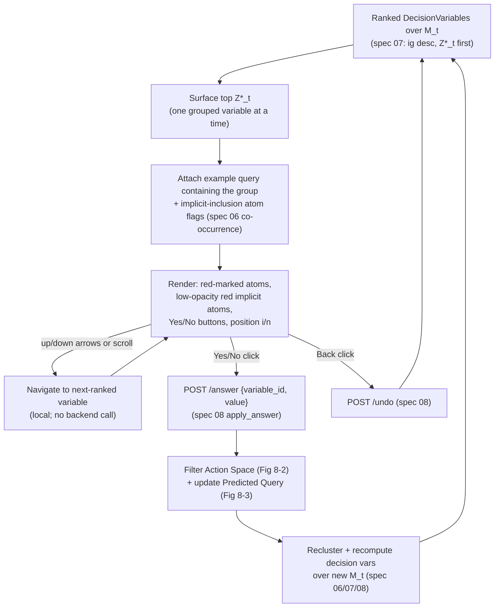

# Visual Interface — Decision Space View

## Overview

The Decision Space is the middle of the three query-refinement views (Figure 6,
p. 8). Its goal is to "guide users through decisions that allow them to
disambiguate their utterances in the most efficient manner" by **listing the
decision variables with the highest information gain** produced by the algorithm
(p. 10). It is the primary driver of the repair loop: the user answers a
**binary Yes/No** question about one grouped decision variable at a time, and
that answer filters the Action Space (spec 12), updates the Predicted Query
(spec 14), and triggers recomputation of the next decision variables over the
surviving candidate set.

This spec is the frontend/backend contract for that view. It reuses
`DecisionVariable` (spec 02: `group`, `label`, `value_of`, `ig`, `in_prob`), the
grouping/lift/co-occurrence machinery (spec 06), the IG ranking and top `Z*_t`
selection (spec 07), and the `/decision_space`, `/answer`, and `/undo` endpoints
(spec 11). It defines **no new algorithm behavior** — only how the ranked
variables and their example query are serialized and presented.

## Paper grounding

- Purpose: "The goal of the *Decision Space* is to guide users through decisions
  that allow them to disambiguate their utterances in the most efficient manner.
  To do so, this view lists decision variables with the highest information gain,
  determined by the algorithm introduced in Section 5." (p. 10). The ranking and
  `Z*_t = argmax IG` come from spec 07.
- Why a full ranked list and not just the single best: "Even if decision
  variables yield high information gain, they may not necessarily capture the
  characteristics most relevant for disambiguation with respect to the user's
  intent, since many intents are possible." (p. 10). Hence the user can move past
  the top suggestion.
- One at a time + navigation: "the user accesses one (grouped) decision variable
  at a time but can iterate through the alternatives by either clicking the up
  and down arrow keys on the keyboard or using the scroll function of the
  corresponding panel." (p. 10).
- Example query under the variable: "Underneath the red-marked decision
  variables, we display an example query that contains the particular variable.
  This example should help contextualize and interpret the given variable,
  especially if it consists of multiple atomic features." (p. 10). Rendered with
  the global rationale of Section 8.1, "whereby the decision variables are
  colored red." (p. 10).
- Global color encoding (Section 8.1, p. 9): decision variables are colored in a
  **red** shade (not light gray) because "previous research indicates that this
  color functions as a signal of relevance, conveying that a stimulus is
  important and merits attention." A red color scale colors queries that would be
  filtered if the variable is accepted; a blue color scale colors queries that
  exclude the current decision variable.
- Implicit-inclusion highlight: "we identify and highlight — using a low-opacity
  red color — the features in the example query that would be implicitly included
  in the final query if the user selects the decision variable (see, e.g., JOIN
  Film feature in Figure 9, decision x+1)." (p. 10). "Implicitly included" is the
  co-occurrence quantity of spec 06 (Eq. 6).
- Core binary interaction: "The most important interaction is the binary decision
  of whether to select a variable, thereby filtering for queries that include it,
  or to reject the variable, which instead filters queries that exclude it. The
  binary decision is made by clicking on the 'Yes' or 'No' button displayed under
  the query example. As shown in Figure 8, by clicking on one of the buttons,
  queries that contain/exclude the variables are filtered in the *Action Space*,
  and new decision variables are computed based on the new query sample. In
  addition, the *Predicted Query* panel [is] updated with atomic features that are
  likely to occur in the final query." (p. 10). Figure 8 markers: (1) Yes/No
  buttons under the query example, (2) filtering in the Action Space, (3) update
  of the Predicted Query.
- Reversible / skippable: "Every decision made can be reversed by clicking on the
  *Back* button, as shown in Figure 9. Alternatively, the users can simply skip
  the suggested decision variable and explore the alternative variables by using
  the up and down arrow keys or the scroll bar." (p. 10). In Figure 9 the *Back*
  button (marker 2) reverses decision `x+1` back to decision `x` (labelled
  `undo`).
- Linked highlighting: "By hovering over the decision variable, queries
  containing these features will be highlighted in the *Action Space*. By hovering
  over the example query, the particular query glyph will be highlighted." (p. 10).
- Study-informed UX note: the study explicitly contrasted the "grouped,
  prioritized decision variables in the *Decision Space*" against the baseline of
  "ordered, atomic decision variables in the *Predicted Query* panel" (p. 11).
  The Discussion (p. 14–15) reports participants found the grouped, prioritized
  variables *less effortful* than atomic ones, but that prioritization sometimes
  made it *harder to track progress*. This view already provides the Back
  affordance (p. 10, Fig 9); the finding is consistent with also surfacing a
  position indicator (see A-ds-4/A-ds-6) to help users keep their place.

## Architecture



## Components

### Backend payload — `GET /session/{id}/decision_space`

Built by `src/pleasqlarify/server/views/decision_space.py` from the current
`SessionState` (spec 02). It serializes the **ranked** list of decision variables
(spec 07) plus, for the currently focused one, an example query with
implicit-inclusion flags.

```
DecisionSpaceView:
  turn: int
  current_index: int              # which variable is focused (default 0 => Z*_t)
  count: int                      # number of navigable variables (== len(variables))
  variables: list[DecisionVariableView]   # ordered by ig DESC; variables[0] == Z*_t

DecisionVariableView:
  variable_id: str                # DecisionVariable.id (used in /answer)
  label: str                      # human rendering of the group (spec 02)
  atoms: list[AtomView]           # the grouped atomic features g (spec 06)
  ig: float                       # expected information gain (spec 07)
  in_prob: float                  # implicit-inclusion probability (spec 06, Eq 6)
  example: ExampleQueryView       # a query from the cluster that CONTAINS the group

AtomView:
  index: int                      # dimension in z (spec 02 FeatureVocabulary)
  kind: str                       # SELECT_COL, FROM_TABLE, JOIN, WHERE_PRED, ...
  payload: str                    # canonical rendering, e.g. "JOIN Film"
  role: enum { DECISION, IMPLICIT, PLAIN }

ExampleQueryView:
  candidate_id: str               # the representative query surfaced
  atoms: list[AtomView]           # ordered as rendered in the query list-of-atoms
```

- `variables` MUST be ordered by `ig` descending with `Z*_t` first (spec 07,
  Eq. 8). Ties broken deterministically per spec 07 (A-rank-4: prefer the more
  balanced split, then lexical by `label`).
- In `example.atoms`, an atom's `role` is:
  - `DECISION` — it belongs to the focused variable's `group` (rendered red, the
    "red-marked decision variables", p. 10);
  - `IMPLICIT` — it is *implicitly included*: not in the group, but its
    co-occurrence probability given the group exceeds the threshold (spec 06
    Eq. 6; rendered low-opacity red, p. 10, e.g. `JOIN Film` in Figure 9);
  - `PLAIN` — neither (rendered with the default atom style, spec 12/14).
- The payload carries the full ranked list so the frontend can navigate
  (arrows/scroll) **without** a round trip; only Yes/No/Back hit the backend.

### Frontend panel — `frontend/src/views/DecisionSpace.*`

- Displays **one** variable at a time: its red-marked atoms, the heading "An
  example query from the cluster," the example query as a list of atoms (with
  `DECISION` atoms red and `IMPLICIT` atoms low-opacity red), and the **Yes/No**
  buttons directly beneath the example (Figure 8, marker 1).
- Shows a navigation position indicator `current_index+1 / count` so users keep
  their place while stepping through variables (a spec addition; see A-ds-6).
  Note: Figure 9 shows a `2/2` counter next to the Back/undo control, which reads
  as a *decision-step* counter, not this navigation index — the two are distinct.
- Navigation: **up/down arrow keys** and the **scroll bar / wheel** step
  `current_index` through `variables` locally (p. 10). This does not change the
  belief or candidate set — it only re-focuses the panel.
- **Yes** and **No** call `/answer`; **Back** calls `/undo` (see Interactions).
- On hover of the variable or the example query, emits linked-highlight events to
  the Action Space (spec 12).

## Interactions

| Gesture | Effect | Backend call |
|---|---|---|
| Click **Yes** | Select the focused variable: filter Action Space to queries that **contain** it (Fig 8-2), update Predicted Query (Fig 8-3), recompute next variables over new `M_t` | `POST /session/{id}/answer` `{variable_id, value: true}` (spec 08) |
| Click **No** | Reject the focused variable: filter Action Space to queries that **exclude** it, update Predicted Query, recompute next variables | `POST /session/{id}/answer` `{variable_id, value: false}` (spec 08) |
| Click **Back** | Reverse the most recent decision (Fig 9-2, `undo`); restore prior `M_t`, belief, ranked list, and focus | `POST /session/{id}/undo` (spec 08) |
| Up / Down arrow key | Move `current_index` to previous / next ranked variable (skip the suggestion) | none (local navigation) |
| Scroll bar / wheel | Same as arrows: step `current_index` through `variables` | none (local navigation) |
| Hover decision variable | Highlight, in the Action Space, all queries whose `z` contains the variable's atoms | none (client event to spec 12) |
| Hover example query | Highlight that single query's glyph in the Action Space | none (client event to spec 12) |

After `/answer` and `/undo` the backend returns a full `StateView` (spec 11) so
all three linked views refresh consistently; the frontend resets
`current_index` to 0 (the new `Z*_t`) on each answer.

## Core Assumptions & Undocumented Decisions

- **A-ds-1 — Which example query is shown.** The paper says only "an example query
  that contains the particular variable" from "the cluster" (p. 10) but not which
  member of the cluster.
  - *Recommended default:* the cluster's **representative** member
    (`Cluster.representative_id`, spec 02) restricted to those containing the
    group; among those, the **highest-belief / highest-probability** member
    (`p_t(m)`, and within it the most-sampled candidate by `gen_count`). This
    surfaces the most typical query for the variable.
  - *Alternatives:* (a) the shortest/simplest containing query (fewest atoms —
    easiest to read); (b) a random containing member; (c) the medoid of the
    containing members. Flagged: affects which JOIN/WHERE atoms a user sees.
- **A-ds-2 — Implicit-inclusion threshold for the low-opacity highlight.** The
  paper highlights features "that would be implicitly included" (p. 10) but gives
  no cutoff.
  - *Recommended default:* reuse spec 06's co-occurrence: an atom is `IMPLICIT`
    when `0 < p(atom | group) < 1` and `p(atom | group) ≥ τ_in` with a default
    `τ_in = 0.5`. Group atoms are always `DECISION`. (Certainty — the
    `determined` / 100% mark — is a *Predicted Query* concern, Fig 9 caption /
    spec 06 A8d / spec 14; the Decision Space example query does not render a
    determined state.)
  - *Alternatives:* (a) any `p > 0` highlighted (matches the Predicted Query
    "probability > 0" rule, p. 10 — more atoms lit); (b) a higher `τ_in` for less
    clutter. Flagged: tie the chosen `τ_in` to spec 06 so the highlight and the
    Predicted Query agree.
- **A-ds-3 — Which variables appear in the list (characteristic vs all).** Spec 06
  keeps only characteristic groups (`lift > 1`); spec 07 ranks whatever it is
  given.
  - *Recommended default:* list only **characteristic** variables (`lift > 1`)
    ranked by IG — these are what the algorithm proposes as meaningful splits.
  - *Alternative:* include all IG-positive variables (larger navigable list).
    Flagged: interacts with A-ds-4.
- **A-ds-4 — How many variables are navigable.** Not specified.
  - *Recommended default:* all characteristic variables with `ig > 0`, capped at
    `K = 20` to bound scrolling (the study noted long lists were effortful,
    p. 11 / spec 15). `count` reflects the served number.
  - *Alternative:* unbounded; or a small fixed top-`k` (e.g. 5). Flagged.
- **A-ds-5 — IG tie ordering.** Inherited from spec 07 (A-rank-4): on equal `ig`,
  prefer the more balanced split (`P_t(Z=v)` nearer 0.5), then lexical by
  `label`. Recorded here because it fixes navigation order.
- **A-ds-6 — Keyboard vs scroll semantics.** Paper lists both (p. 10) without
  detail.
  - *Recommended default:* arrows and scroll are equivalent and **clamp** at the
    ends (no wrap-around); the panel keeps keyboard focus while hovered/active so
    arrow keys do not scroll the page. Position indicator `i/n` always visible.
  - *Alternative:* wrap-around navigation. Flagged: minor UX.

## Testing Strategy

- Unit: `decision_space` payload lists variables in `ig`-descending order with
  `variables[0].variable_id == Z*_t.id` (spec 07); ties resolved deterministically.
- Unit: the `example` query for each variable actually **contains** every atom in
  that variable's `group` (`group ⊆ z(example)`), on the golden `SessionState`
  fixture (spec 02).
- Unit: an atom flagged `IMPLICIT` in `example.atoms` has co-occurrence
  `p(atom | group)` above `τ_in` and below 1 (matches spec 06 Eq. 6);
  `DECISION` atoms are exactly the group atoms; a `p ≥ 0.999` atom is not marked
  merely `IMPLICIT`.
- Integration: `POST /answer {value:true}` on the focused variable shrinks `M_t`
  to the containing subset and returns a new ranked list (candidate-set update),
  consistent with the Action Space / Predicted Query in the same `StateView`
  (spec 11).
- Integration: `POST /answer` then `POST /undo` restores the prior payload
  (variables, `current_index`, `turn`) byte-for-byte on a cached-generation
  sample (Back reversibility, Fig 9).
- Unit (frontend): arrow/scroll steps `current_index` within `[0, count-1]`
  without a backend call and updates the `i/n` indicator.

## Acceptance Criteria

1. `GET /decision_space` returns decision variables ordered by information gain
   with `Z*_t` first, each carrying `label`, `atoms`, `ig`, `in_prob`, and an
   example query (cite p. 10; spec 07).
2. The example query for a variable contains all of that variable's grouped
   atoms, and implicit-inclusion atoms are flagged per spec 06 co-occurrence and
   rendered low-opacity red (cite p. 10, Fig 9).
3. Decision variables and their group atoms are rendered red per the global color
   rationale (Section 8.1, p. 9).
4. The panel shows one variable at a time; up/down arrows and the scroll bar
   navigate the ranked list locally with no backend call, and a navigation
   position indicator reflects `current_index` (cite p. 10; indicator per A-ds-6).
5. Clicking **Yes**/**No** issues `POST /answer` and produces an updated candidate
   set, filtered Action Space, and updated Predicted Query in one `StateView`
   (cite p. 10, Fig 8 markers 1–3; spec 11).
6. Clicking **Back** issues `POST /undo` and restores the prior state (cite p. 10,
   Fig 9 marker 2).
7. Hovering the variable highlights containing queries in the Action Space;
   hovering the example query highlights its glyph (cite p. 10; spec 12).
8. Assumptions A-ds-1..6 are recorded with recommended defaults and alternatives.
