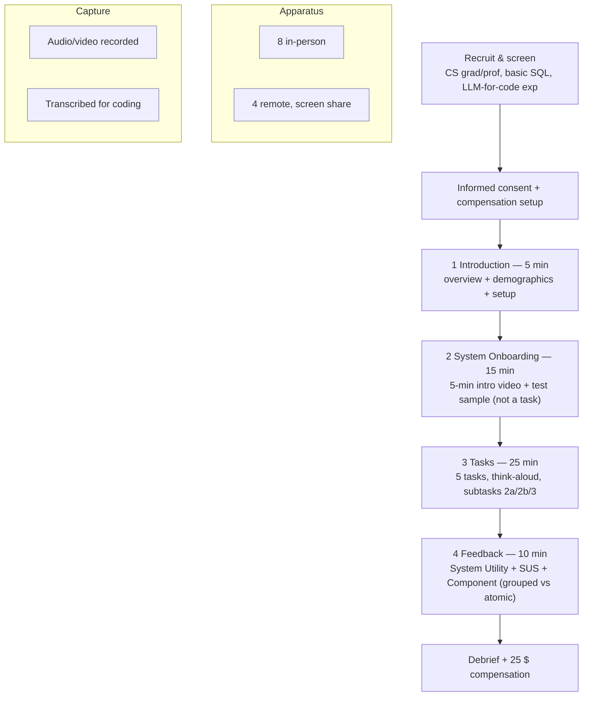

# User-Study Protocol and Materials

## Overview

Running this study validates whether **pragmatic repair** — the paper's mechanism
for interactively grounding an ambiguous natural-language utterance against a
database — actually helps people query text-to-SQL under uncertainty. It
reproduces the CHI '26 evaluation (Chan, Sevastjanova, El-Assady; Section 9,
pp. 11–14) as an executable protocol so a new researcher can run it identically
against the implemented system. The study is framed around the paper's two
research questions (p. 11): **RQ1 — Understanding the Probable Action Space**
("Does the system help users recognize and distinguish among the LLM's possible
interpretations of an utterance?") and **RQ2 — Navigating the Action Space** ("Do
the decision variables enable users to move through this space in a way that feels
efficient while remaining comprehensible?").

## Paper grounding

All facts below are transcribed from the PDF; page numbers are the paper's.

### Participants (Section 9.1, p. 11)

- **N = 12** computer-science graduate students and professionals.
- Age **M = 27.3, SD = 1.8**; gender **4 F / 8 M**.
- SQL familiarity: **9 intermediate** ("some exposure to writing and interpreting
  SQL queries"), **3 advanced** ("doing so regularly"). No participant reported
  zero SQL familiarity (basic SQL was a recruitment requirement).
- **All 12** reported some experience using large language models for code
  generation or debugging.

### Procedure (Section 9.2, p. 11)

- Session length **45–60 minutes**, four main sections.
- **8 sessions in person, 4 remote** (remote due to limited participant
  availability; remote participants shared their screen while solving tasks).
- Every session was **recorded and transcribed** for later analysis.
- **Informed consent** obtained from each participant.
- **Compensation: 25 $** per participant.

The four timed sections (p. 11):

| # | Section | Duration | Contents (paper wording) |
|---|---|---|---|
| 1 | Introduction | 5 min | Welcome; brief overview of study procedure; help set up PleaSQLarify on the participant's device (if needed); collect demographics + SQL expertise + LLM experience. |
| 2 | System Onboarding | 15 min | Watch a **5-minute system introduction video** walking through all relevant system components; then test the features on a **test sample that is *not* one of the five tasks**, ensuring participants can access the test database, interact with datapoints in the *Action Space*, and navigate the *Decision Space* + clauses in the *Predicted Query* panel. |
| 3 | Tasks | 25 min | Complete **5 tasks** of varying difficulty **thinking aloud**; participants may ask questions at any time; conductors may ask a participant to clarify an unclear answer. |
| 4 | Feedback | 10 min | Questionnaires on overall utility vs. standard LLM querying; per-component feedback incl. **grouped (Decision Space) vs. atomic (Predicted Query) decision-variable comparison**; a **System Usability Scale (SUS)** questionnaire; open verbalized feedback during/after the questionnaires. |

### Tasks & data (Section 9.3, pp. 11–12)

- Five tasks built from **AMBROSIA** samples drawn from the paper's quantitative
  evaluation set (Section 7), all from the **Filmmaking** domain (chosen to reduce
  cognitive load — same domain across tasks). Each AMBROSIA sample has ≥ 2
  high-level semantic interpretations with corresponding gold SQL, and a small DB
  (~5 tables, < 10 rows/columns per table).
- Sample selection by ambiguity type: **2 vague, 2 attachment, 1 scope** (p. 11).
  The paper notes vague queries carry basic column ambiguities from imprecise
  wording, whereas attachment/scope are "more challenging — both in the reasoning
  needed for disambiguation and in the length and complexity of the resulting SQL
  programs" (p. 12).
- Each task is split into **three parts** (p. 12): (1) *Utterance interpretation*
  — the participant **verbally** describes a plausible interpretation/output;
  (2) *Exploration* — examine candidates and their clustering to understand (a)
  functional differences (how outputs varied) and (b) structural differences
  (which SQL clauses caused them); (3) *Navigation* — narrow the candidate set to
  the one best matching the participant's own utterance interpretation.
- Table 1's **scored subtasks** (legend, p. 12): **2a** Identify interpretation
  clusters; **2b** Understand semantic difference between clusters; **3** Navigate
  to utterance interpretation. (Part 1, the verbal interpretation, is the
  uncoded setup and is *not* a scored row.)

The five tasks (Table 1, p. 12):

| Task | Utterance | Ambiguity type | Complexity |
|---|---|---|---|
| T1 | "What was the review of *Pulp Fiction*?" | Column Vagueness | Low |
| T2 | "What's the rating of the movies with Leonardo DiCaprio?" | Column Vagueness | Medium |
| T3 | "Show me scripts and editors with a deadline of 21.04.03." | Attachment | High |
| T4 | "Show all the action movies and romantic comedies lasting 2 hours." | Attachment | Medium |
| T5 | "What film categories does each film festival offer?" | Scope | High |

### Results reproduced for comparison (Section 10, pp. 12–14)

- **Task completion 84.4%** overall across SQL-expertise levels; every task was
  completed at least once (p. 12).
- Subtask 2a (describe clusters in the Action Space) was solved by most across
  tasks; **P3, P9, P12 dropped out for time reasons after completing T4** (p. 12).
- Subtask 2b was hardest for T3 (subtle filtering condition) and T5 (many joins +
  complex filtering) (p. 12).
- Subtask 3: **7/12 struggled** with not finding their original interpretation for
  ≥ 1 task, but when prompted to consider alternatives could reach a different
  satisfactory interpretation (orange in Table 1) (p. 12).
- System-utility means (Fig 10, 7-point): **Discover Alternative Interpretations
  M = 5.92** (p. 13); **Perceived Control M = 5.50** (p. 13); **Interaction
  Efficiency M = 5.67** (p. 14); **Decision Understandability M = 5.75** (p. 14).
- SUS-style per-item 7-point means: **easy to use M = 5.08**, **well-integrated
  components M = 5.83**, **interact confidently M = 5.17** (p. 13).
- Grouped vs. atomic decision variables: **understandability 5.33 vs. 4.92**;
  **interaction effort 3.25 vs. 4.42** (p. 14, Fig 12).
- Component contrast (Fig 12): Action Space more useful for contrasting functional
  output groups (**5.67 vs. 4.83**); decision variables more useful for
  understanding cluster differences (**5.33 vs. 4.67**) (p. 14).

## Study design



- **Recruitment & screening.** Target: 12 CS graduate students / professionals.
  Screening criteria (met by the paper's sample): (i) at least *basic* SQL
  familiarity — able to read and write simple SQL (exclude "no familiarity");
  (ii) prior experience using an LLM for code generation or debugging. Record
  self-reported SQL level as `intermediate` or `advanced` (target mix ≈ 9/3 to
  mirror the paper; see assumption **U8**).
- **Consent.** Written informed consent before any recording (see assumption
  **U3** for the form + ethics approval).
- **Apparatus.** In-person: participant uses the system on their own device (set
  up in the Introduction) or a provided machine; conductor co-located. Remote:
  video call with **continuous screen sharing** during task solving; system runs
  on the participant's device. Keep the two modalities otherwise identical
  (same script, same materials, same recording).
- **Recording / transcription.** Record audio + screen for all sessions;
  transcribe verbatim for qualitative coding. Store recordings under
  participant-pseudonymous IDs (P1…P12).
- **Compensation.** 25 $ (or local-currency equivalent) paid regardless of task
  completion.

## Tasks

### Task table (with AMBROSIA mapping)

`sample_id` / `db_path` are **resolved before execution** by the procedure in
assumption **U4** (the paper gives no IDs). The user-study subset is the one
declared in `foundations/01-environment-and-data.md` (Filmmaking: 2 vague, 2
attachment, 1 scope).

| Task | Utterance | Ambiguity | Complexity | AMBROSIA sample (to pin) |
|---|---|---|---|---|
| T1 | "What was the review of *Pulp Fiction*?" | vague (column) | Low | Filmmaking vague #1 → `sample_id`=`<pin U4>` |
| T2 | "What's the rating of the movies with Leonardo DiCaprio?" | vague (column) | Medium | Filmmaking vague #2 → `<pin U4>` |
| T3 | "Show me scripts and editors with a deadline of 21.04.03." | attachment | High | Filmmaking attachment #1 → `<pin U4>` |
| T4 | "Show all the action movies and romantic comedies lasting 2 hours." | attachment | Medium | Filmmaking attachment #2 → `<pin U4>` |
| T5 | "What film categories does each film festival offer?" | scope | High | Filmmaking scope #1 → `<pin U4>` |

### Three-subtask structure (per task)

- **Part 1 — Utterance interpretation (uncoded).** Before touching the system,
  the participant verbally states one plausible interpretation of the utterance
  (what output they expect). This anchors the *original interpretation* that
  Part 3 (subtask 3) is scored against. Record verbatim.
- **Subtask 2a — Identify interpretation clusters (coded).** Using the *Action
  Space*, the participant describes the candidate clusters (distinct
  interpretations) present.
- **Subtask 2b — Understand semantic difference between clusters (coded).** The
  participant explains how the clusters differ, both functionally (how outputs
  vary) and structurally (which SQL clauses drive the difference).
- **Subtask 3 — Navigate to utterance interpretation (coded).** The participant
  narrows the candidate set (via Decision Space / Predicted Query) to the query
  matching their Part-1 interpretation. If they cannot find it, prompt them to
  consider alternatives; reaching a *different but satisfactory* interpretation
  counts as partial (see coding scheme).

### Task-completion coding scheme (Table 1)

Each of the 3 scored subtasks per task per participant gets one color:

| Color | Meaning | Counts as success? |
|---|---|---|
| 🟩 green | Solved | Yes |
| 🟨 yellow | Partial — participant **found a better query** than their original | Yes |
| 🟧 orange | Partial — participant **did not find the original query** but reached another satisfactory interpretation | Yes |
| 🟥 red | Not solved | No |

**Overall completion 84.4%** is the average over **180 tasks = 12 participants ×
5 tasks × 3 subtasks**, counting *both* partial colors as correct (p. 12,
footnote 6):

```
completion = (#green + #yellow + #orange) / 180
only red counts as failure.
```

Because P3/P9/P12 dropped out after T4, their T5 subtasks (3 participants × 3
subtasks = 9 cells) were not attempted; the denominator stays **180**, so those
cells effectively count as **not-solved (red)** in the rate.

## Instruments (questionnaires)

Administer in the Feedback section. All Likert instruments use a **7-point** scale
(1 = strongly disagree … 7 = strongly agree) to match the paper's reported means.
Materials live under `study/questionnaires/`.

### 1. System Utility (Fig 10) — stem "Using the system, I could…"

7-point Likert, one item per construct:

1. **Discover Alternative Interpretations** — "…discover alternative
   interpretations of my query." (paper M = 5.92)
2. **Clarify Target Query Efficiently** — "…clarify my target query
   efficiently." (Interaction Efficiency, M = 5.67)
3. **Clarify Target Query Understandably** — "…clarify my target query in an
   understandable way." (Decision Understandability, M = 5.75)
4. **Feel in Control of Output** — "…feel in control of the produced output."
   (Perceived Control, M = 5.50)

### 2. SUS (System Usability Scale)

The paper reports **SUS-style items on a 7-point scale** and quotes per-item
means (easy-to-use 5.08; well-integrated 5.83; confident 5.17) — it does **not**
report a 0–100 composite (see assumption **U2**). Administer the **standard 10
SUS items** (odd = positive, even = negative), matching Fig 10's labels:

1. I would like to use this system frequently. *(+)*
2. I found the system unnecessarily complex. *(−)*
3. I thought the system was easy to use. *(+)* — paper M = 5.08
4. I think I would need technical support to be able to use this system. *(−)*
5. I found the various functions in this system were well integrated. *(+)* —
   paper M = 5.83
6. I thought there was too much inconsistency in this system. *(−)*
7. I would imagine most people would learn to use this system very quickly. *(+)*
8. I found the system very cumbersome to use. *(−)*
9. I felt very confident using the system. *(+)* — paper M = 5.17
10. I needed to learn a lot of things before I could get going with this system.
    *(−)*

### 3. Component questionnaire (Fig 12) — 7-point, grouped by component

Three component groups: **Action Space**; **Decision Space / Grouped Decision
Variables**; **Predicted Query / Atomic Decision Variables**. For each applicable
component, administer the construct items below (exact participant-facing wording
is an undocumented detail — see assumption **U7**; construct labels are the
paper's):

- **Utility for Exploration**
- **Utility for Understanding Output Groups** (Action Space; paper: 5.67 for
  Action Space vs. 4.83 for decision variables)
- **Utility for Understanding Cluster Differences** (decision variables: 5.33 vs.
  Action Space 4.67)
- **Decision Variable Understandability** (grouped 5.33 vs. atomic 4.92)
- **Decision Transparency**
- **Interaction Effort** (grouped 3.25 vs. atomic 4.42; **lower = better**)

### Reported means to reproduce / compare against

| Construct | Instrument | Paper mean | Page |
|---|---|---|---|
| Discover Alternative Interpretations | System Utility | 5.92 | 13 |
| Perceived Control (Feel in Control) | System Utility | 5.50 | 13 |
| Interaction Efficiency (Clarify Efficiently) | System Utility | 5.67 | 14 |
| Decision Understandability (Clarify Understandably) | System Utility | 5.75 | 14 |
| Easy to use | SUS item 3 | 5.08 | 13 |
| Well-integrated components | SUS item 5 | 5.83 | 13 |
| Interact confidently | SUS item 9 | 5.17 | 13 |
| Understandability: grouped vs. atomic | Component | 5.33 vs. 4.92 | 14 |
| Interaction effort: grouped vs. atomic | Component | 3.25 vs. 4.42 | 14 |
| Understanding output groups: Action Space vs. decision vars | Component | 5.67 vs. 4.83 | 14 |
| Understanding cluster differences: decision vars vs. Action Space | Component | 5.33 vs. 4.67 | 14 |

## Measures & analysis

**Dependent measures**

1. **Task-completion coding** — the color per (participant × task × subtask), and
   the aggregate 84.4%-style rate (partial = success; only red = failure). The 9
   unattempted T5 cells (P3/P9/P12) stay in the denominator as red.
2. **Likert responses** — System Utility (4 items), Component questionnaire (6
   constructs × applicable components), on 7-point scales.
3. **SUS** — 10 items, 7-point; report per-item means (matching the paper) and,
   optionally, a rescaled composite (flag the rescaling — see **U2**).
4. **Think-aloud qualitative themes** — coded from transcripts (e.g. recognizing
   ambiguity, discovering better alternatives, feeling over-constrained,
   query-writing guidance, learning curve).

**Interaction workflows to code (Fig 11, p. 14).** After the shared initial
exploration in the Action Space, code each participant's dominant navigation path
into one of three workflows:

- **W1 — decision-based navigation** (most common): explore Action Space clusters
  → filter via grouped/ranked decision variables in the Decision Space → converge;
  minimal Predicted-Query clause selection.
- **W2 — clause-level navigation**: navigate by filtering individual clauses in
  the *Predicted Query* panel.
- **W3 — output-based navigation**: explicitly choose desired output behavior
  (lasso-select the correct output cluster, identify equivalent queries, validate
  SQL/output).

**Analysis approach.** Primarily **descriptive** (the paper reports means and
completion percentages, no inferential tests): report per-construct means (and
SD) for all Likert instruments; the completion-rate breakdown by task, subtask,
and SQL expertise; and workflow frequencies (W1/W2/W3). Qualitative analysis:
thematic coding of transcripts with representative quotes. Any inferential test
(e.g. grouped-vs-atomic paired comparison) is an addition beyond the paper and
must be flagged (see **U6**).

## Core Assumptions & Undocumented Decisions

> Paper-first: the sections above follow the paper exactly and cite pages. The
> items below are **not** specified by the paper. Each gives a recommended
> default, alternatives, and what the paper implies. The advertised code repo is
> an empty Copilot stub and is **not** used as ground truth.

- **U1 — Onboarding video content/script.** The paper says a *5-minute video
  walking through all relevant components* (p. 11) but gives no script.
  - *Default:* a scripted 5-min screen-capture covering, in order, the Action
    Space (clusters + tooltips), Decision Space (grouped/ranked decision
    variables, Yes/No answering, Back/undo), and Predicted Query (atomic clauses,
    probabilities, determined features), ending on the test sample. Store the
    script + video under `study/onboarding/`.
  - *Alternatives:* live scripted demo by the conductor (harder to keep
    identical across 12 sessions); interactive guided tour in-app.
  - *Paper implies:* fixed video (identical exposure) covering exactly the three
    UI components in specs 12–14.
- **U2 — SUS scale variant / rescaling.** Standard SUS is 10 items on a
  **5-point** scale scored to a **0–100** composite via the alternating ± formula.
  The paper reports only **per-item 7-point means** (5.08, 5.83, 5.17) and **no
  composite**.
  - *Default:* administer SUS on **7-point** to reproduce the paper's per-item
    means; report per-item means, do **not** claim a standard 0–100 score.
  - *Alternatives:* (a) also run canonical 5-point SUS for a comparable composite;
    (b) compute a rescaled 0–100 from the 7-point responses (map 1–7→0–100) and
    label it explicitly as non-standard.
  - *Paper implies:* 7-point per-item reporting; a standard composite is **not**
    directly computable from 7-point items and the paper never reports one — do
    not assert they rescaled.
- **U3 — Consent form + ethics/IRB approval.** The paper states informed consent
  was obtained (p. 11) but gives no form text, IRB/ethics-board name, or approval
  number (ETH Zurich context).
  - *Default:* obtain approval from the executing institution's ethics board
    before running; use a consent form covering recording, screen sharing,
    transcription, pseudonymized storage, and withdrawal rights. Store under
    `study/consent/`.
  - *Alternatives:* exempt/expedited review if the institution permits low-risk
    HCI studies; verbal consent for remote sessions (record the verbal consent).
  - *Paper implies:* a real approval existed (CHI requires it) but is undocumented
    here; must be re-established locally.
- **U4 — Exact AMBROSIA sample-id mapping per task.** The paper gives utterances,
  ambiguity types, and complexity (Table 1) and the 2/2/1 Filmmaking split
  (p. 11) but **no sample IDs**. This is also an acceptance criterion.
  - *Default (deterministic resolution, done before execution):* from the
    user-study subset in `foundations/01-environment-and-data.md`, for each of the
    five utterances select the Filmmaking AMBROSIA sample whose ambiguous
    utterance matches (or is closest to) the Table-1 wording **and** whose ≥ 2
    gold interpretations realize the stated ambiguity (column-vagueness for T1/T2,
    attachment for T3/T4, scope for T5). Pin the resolved `sample_id` + `db_path`
    in `study/tasks/` and treat it as fixed (mirroring how spec 01 resolves F1
    before use).
  - *Alternatives:* if an exact utterance match is absent, either author a matched
    Filmmaking sample honoring the ambiguity type (flagged as authored) or pick
    the nearest same-type sample and record the substitution.
  - *Paper implies:* concrete, existing AMBROSIA Filmmaking samples were used;
    only the IDs are missing, so resolution (not invention) is required.
- **U5 — Inter-rater reliability for completion coding.** The paper presents
  Table 1 colors but no coding procedure or agreement statistic.
  - *Default:* two independent coders code all 180 cells from transcripts +
    recordings against the rubric above; report Cohen's κ; adjudicate
    disagreements by discussion; pre-register the rubric.
  - *Alternatives:* single coder with a subset (e.g. 20%) double-coded for
    reliability; three coders with majority vote.
  - *Paper implies:* the conducting authors coded outcomes; no reliability metric
    was reported, so add one for rigor.
- **U6 — Statistical tests vs. purely descriptive.** The paper reports means and
  percentages only; no p-values or CIs appear.
  - *Default:* **descriptive** stats (means, SD, counts, workflow frequencies) to
    match the paper.
  - *Alternatives:* add paired comparisons (e.g. Wilcoxon signed-rank for grouped
    vs. atomic understandability/effort) and bootstrap CIs, clearly labeled as
    extensions beyond the paper; note N = 12 limits power.
  - *Paper implies:* purely descriptive analysis.
- **U7 — Exact participant-facing questionnaire wording.** The paper gives
  *construct labels* (Figs 10, 12), not verbatim item text.
  - *Default:* use the item phrasings drafted in the Instruments section; freeze
    them under `study/questionnaires/` so all sessions administer identical
    wording.
  - *Alternatives:* adopt validated instrument wording where one exists (SUS) and
    author the rest.
  - *Paper implies:* short 7-point agree/disagree items per construct.
- **U8 — Recruitment mix & demographics as targets vs. hard quotas.** The paper's
  4F/8M and 9-int/3-adv split are *observed*, not a stated sampling frame.
  - *Default:* recruit any 12 qualifying CS grads/professionals with basic SQL +
    LLM-for-code experience; record demographics but do not enforce quotas; report
    the achieved distribution.
  - *Alternatives:* quota-sample to reproduce 4F/8M and 9/3 for closer comparison.
  - *Paper implies:* a convenience sample meeting the SQL + LLM criteria.

## Acceptance Criteria

1. A new researcher can execute the full session **without consulting the paper**:
   the four sections, their durations (5/15/25/10 min), apparatus (in-person vs.
   remote screen share), recording/consent/compensation, and the onboarding flow
   (video + test sample) are all specified here.
2. **All five tasks map to concrete AMBROSIA samples** — each task's `sample_id`
   and `db_path` are pinned via the U4 resolution procedure against the
   Filmmaking user-study subset (2 vague / 2 attachment / 1 scope) and stored in
   `study/tasks/`.
3. **Questionnaires are ready to administer**: System Utility (4 items), the 10
   SUS items, and the Component questionnaire (6 constructs × components) exist as
   7-point instruments under `study/questionnaires/`, with the paper's means
   recorded for comparison.
4. A **coding rubric exists** for both (a) task completion (green/yellow/orange/red,
   partial = success, 180-cell denominator, 84.4% formula) and (b) interaction
   workflows (W1 decision-based / W2 clause-level / W3 output-based), with an
   inter-rater procedure (U5).
5. Every assumption U1–U8 is resolved (or explicitly deferred with a recorded
   decision) before the study is run.
6. The analysis plan is stated (descriptive-first; any inferential test flagged as
   an extension) and the reproduced target means are tabulated for comparison.
